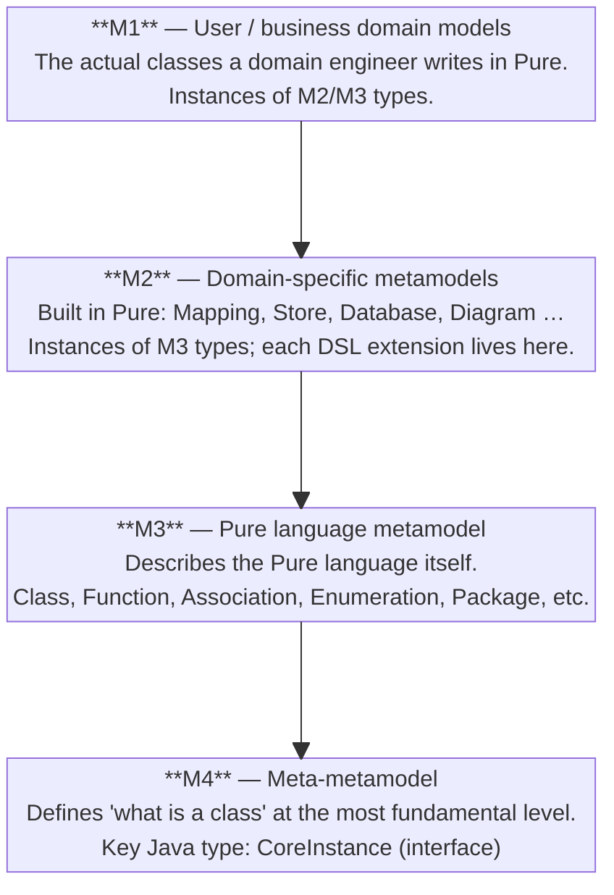
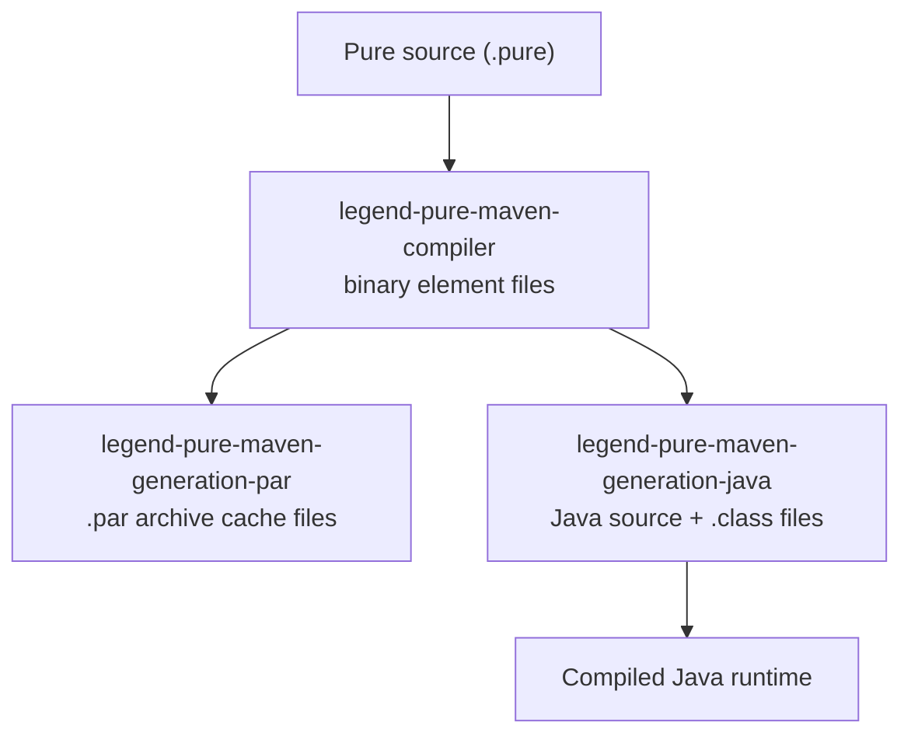

# Legend Pure — Developer Documentation

Welcome to the Legend Pure developer documentation. This living documentation set is
version-controlled alongside the code and should be updated as part of every significant
change.

---

## 5-Minute Overview

### What is Legend Pure?

**Legend Pure is the language and compiler engine that powers the
[FINOS Legend](https://legend.finos.org/) platform.**

Legend (originally developed at Goldman Sachs) is an open-source suite for financial
data management and governance. Legend Pure sits at the very bottom of that stack: it
provides the *language* in which the entire domain model, data mappings, queries, and
business rules are written — and the *compiler + runtime* that executes them.

If you are working anywhere inside the Legend ecosystem, you are working with output
produced by Legend Pure.

Legend Pure sits at the **bottom of the FINOS Legend stack**: `legend-engine` (the
execution and query engine) declares `legend-pure-*` JARs as compile dependencies and
extends the compiler and runtime with engine-specific behaviour; `legend-sdlc` and
`legend-studio` sit above that. Changes to Legend Pure's public Java API are therefore
**breaking changes for the entire Legend platform**. See
[Architecture Overview — Position in the Legend Ecosystem](architecture/overview.md#2-position-in-the-legend-ecosystem)
for the full stack diagram, per-repo relationship table, and release coordination
details.

It solves the problem of data spread across dozens of systems with inconsistent
schemas, by providing a single type-safe language in which domain experts describe
*what* data is and *how* it relates — decoupled from any particular database or
framework. The platform then generates the necessary connectors and transformations.
The six **[Key Objectives](architecture/overview.md#1-what-is-legend-pure)** and the
**[full architecture diagrams](architecture/overview.md#3-high-level-architecture)**
are covered in the Architecture Overview.

---

### Key Functional Concepts

#### 1. The Pure Language

Pure is a **strongly-typed, functional, expression-oriented language**. Everything is
an expression; there are no statements. Key language features:

- **Classes** — user-defined types with typed properties and multiplicity constraints
  (`[0..1]`, `[1]`, `[*]`)
- **Associations** — first-class bidirectional links between classes
- **Functions** — named, typed, composable; higher-order functions are supported
- **Enumerations** — finite named value sets
- **Lambdas** — anonymous function expressions, used heavily in mappings and queries
- **Generics / type parameters** — parameterized classes and functions
- **Profiles & Tags** — lightweight annotation mechanism (e.g. `@PCT`)

Source files use the `.pure` extension and are organized into named **Repositories**.

#### 2. The Metamodel Layer Stack (M4 → M3 → M2 → M1)

Legend Pure uses a four-layer metamodel architecture — the key to understanding the
entire codebase:



> **Rule of thumb:** if you are editing `legend-pure-m4` you are working on what a
> "node" is. If you are editing `legend-pure-m3-core` you are working on what
> "Class" or "Function" means. If you are editing a DSL module you are working on
> what "Mapping" or "Database" means. If you are writing Pure source you are at M1.

#### 3. Two Execution Modes

| Mode | How it works | When to use |
|------|-------------|-------------|
| **Compiled** | Pure functions are translated to Java classes ahead-of-time during the Maven build | Production; performance-sensitive paths |
| **Interpreted** | A tree-walking interpreter executes the Pure AST at runtime — no code-gen step | IDE tooling; fast feedback during development; PCT testing |

Both modes are supported by this repository. The `legend-pure-runtime` module contains
both engines; DSL and store extensions ship compiled and/or interpreted variants.

#### 4. DSL Extensions

Pure's syntax is extensible. Each DSL adds:

- **Pure source** (`.pure` files defining new metaclasses and functions at M2)
- **Grammar** (ANTLR4 grammar + Java visitor that parses the new syntax)
- **Compiled runtime extension** (Java classes registered with the compiled engine)

Current built-in DSLs: `diagram`, `graph`, `mapping`, `path`, `store`, `tds`.

#### 5. The Maven Build Pipeline

Pure compilation is integrated into the standard Maven lifecycle via five custom
Maven plugins. The pipeline runs automatically during `mvn install`:



#### 6. PAR Files — The Build Cache

A **PAR** (Pure ARchive) file is a binary snapshot of a compiled Pure repository.
Instead of re-parsing thousands of lines of Pure source on every startup, the runtime
loads the PAR. This is the primary performance optimization for both the build and
for production startup time.

#### 7. Platform Compatibility Testing (PCT)

PCT is Legend Pure's integration test contract. Pure functions annotated with `@PCT`
are executed against *both* the compiled engine *and* the interpreted engine on every
build. If the results differ, the build fails. This guarantees that the two execution
paths are always equivalent from a user's perspective.

---

## Documentation Map

| Section | What it covers |
|---------|---------------|
| [Architecture Overview](architecture/overview.md) | What Legend Pure is, the module tree, and component relationships |
| [Module Reference](architecture/modules.md) | Every module, its purpose, and its inter-module dependencies |
| [Compiler Pipeline](architecture/compiler-pipeline.md) | Parse → post-process → validate → serialize → code-gen, compiled vs interpreted engines |
| [Dependency & Technology Stack](architecture/tech-stack.md) | Third-party libraries, version management, and technology rationale |
| [Domain & Key Concepts](architecture/domain-concepts.md) | Core domain model, glossary, and design patterns |
| [Pure Language Reference](reference/pure-language-reference.md) | Syntax, types, multiplicity, collections, milestoning, standard library |
| [Legend Grammar Reference](reference/legend-grammar-reference.md) | Index, quick-reference tables, and a complete `###Pure` + `###Relational` + `###Mapping` example |
| [Mapping Grammar Reference](reference/mapping-grammar-reference.md) | `###Mapping` — class mappings, enumeration mappings, association mappings, set IDs, embedded/inline/otherwise, XStore, aggregation-aware, local properties |
| [Relational Grammar Reference](reference/relational-grammar-reference.md) | `###Relational` — tables, columns, joins, views, filters, database includes |
| [Maven Plugins Reference](reference/maven-plugins-reference.md) | All five custom Maven plugins — purpose, goals, parameters, and POM examples |
| [Getting Started Guide](guides/getting-started.md) | Prerequisites, clone → build → run, profiles, and troubleshooting |
| [Build & CI Guide](guides/build-and-ci.md) | Full build lifecycle, Maven plugins, profiles, and the GitHub Actions pipeline |
| [Contributor Workflow Guide](guides/contributor-workflow.md) | How to add a new DSL extension, native function, or store connector |
| [Exploration & Discovery](guides/exploration.md) | Systematic approach for new engineers exploring the codebase |
| [Coding Standards & Style Guide](standards/coding-standards.md) | Checkstyle rules, naming conventions, Git workflow, and PR checklist |
| [Testing Strategy](testing/testing-strategy.md) | Testing pyramid, frameworks, coverage thresholds, and how to run tests |
| [Documentation Maintenance](maintenance/maintenance.md) | Keeping docs up to date, ownership, and review cadence |
| [Module README Template](templates/module-readme-template.md) | Standard template for per-module README files |
| [Phased Documentation Plan](maintenance/documentation-plan.md) | The phased timeline that produced this documentation set |
| [Architecture Decision Records](decisions/) | ADR-001 JUnit 4; ADR-002 Eclipse Collections; ADR-003 No mocking |

---

## Quick-Start (TL;DR)

```bash
# Prerequisites: JDK 11 or 17, Maven 3.6+
git clone https://github.com/finos/legend-pure.git
cd legend-pure
mvn -T 4 install -DskipTests    # fast first build (4 parallel threads)
mvn -T 4 install                # full build with tests
```

See the [Getting Started Guide](guides/getting-started.md) for the full walkthrough.

---

## Security

To report a vulnerability, follow the process in
[`SECURITY.md`](../SECURITY.md) — do **not** open a public GitHub issue.

---

## Contributing to Docs

1. All documentation lives under `/docs` in Markdown.
2. Every PR that changes code in a module **must** update the corresponding docs if
   behaviour, dependencies, or build steps change.
3. Use the [Module README Template](templates/module-readme-template.md) when adding
   a new module.
4. Run `markdownlint docs/` locally before pushing (optional but recommended).
