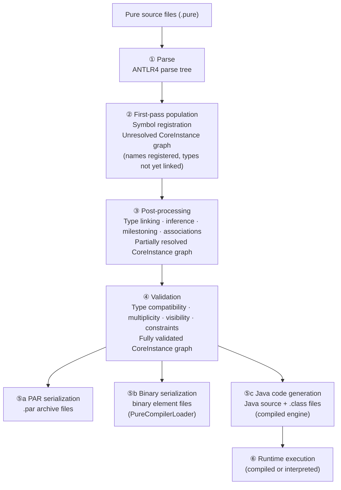
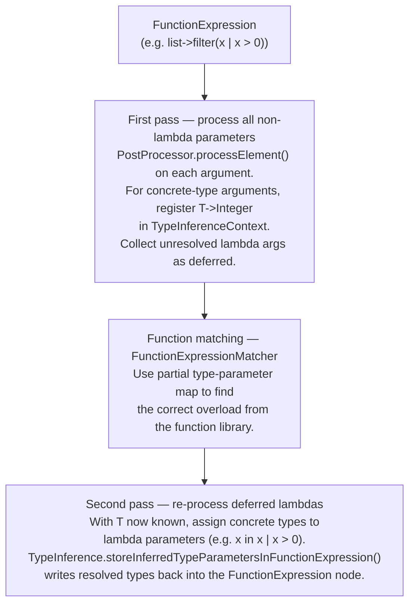

# Compiler Pipeline

This page describes the Legend Pure compiler pipeline — how Pure source text is
transformed into an executable, type-checked `CoreInstance` graph, and ultimately
into either Java bytecode (compiled mode) or an interpretable AST (interpreted mode).

For the Pure language constructs the compiler processes, see the
[Pure Language Reference](../reference/pure-language-reference.md).

---

## 1. Pipeline Overview



---

## 2. Stage-by-Stage Detail

### ① Parse — ANTLR4

**Entry point:** `M3AntlrParser` (in `legend-pure-m3-core`)
**Grammar:** `M3.g4` (in `src/main/antlr4/…/m3parser/antlr/`)

Each `.pure` file is fed to the ANTLR4-generated `M3Parser`. The grammar covers
the entire Pure language syntax: class/enum/function/association definitions,
expressions, lambdas, collection literals, and instance construction (`^`).

DSL extensions register additional inline parsers via `ParserLibrary` and
`InlineDSLLibrary`, so that DSL-specific syntax embedded in Pure source (e.g.
mapping blocks, relational schemas) is handed off to the appropriate
ANTLR4 grammar mid-parse.

**Output:** An initial, unlinked `CoreInstance` graph. Names are recorded but
type references are not yet resolved to their target `CoreInstance` nodes.

---

### ② First-pass Population (Symbol Registration)

**Key class:** `M3AntlrParser` visitor methods

During parsing, all `Package`, `Class`, `Function`, `Enumeration`, `Association`,
and `Profile` definitions are registered into the `ModelRepository` under their
fully-qualified paths. This builds the **symbol table** used by subsequent passes
to resolve cross-references.

---

### ③ Post-processing

**Entry point:** `PostProcessor.process()` (`org.finos.legend.pure.m3.compiler.postprocessing`)

Post-processing runs immediately after parsing and performs type linking and several
semantic rewrites. It executes the following sub-passes **in order**:

| Sub-pass | Method | What it does |
|----------|--------|-------------|
| **Package validation** | `validatePackages()` | Ensures every element has a valid owning package |
| **Function renaming** | `renameFunctions()` | Computes canonical function signatures incorporating parameter types (Pure supports overloading) |
| **Specialization population** | `populateSpecializations()` | Populates the `specializations` back-reference on every supertype so that `Class.specializations` is navigable |
| **Milestoning rewrite** | `populateTemporalMilestonedProperties()` | Detects `<<temporal.*>>` stereotypes and rewrites the class: generates `allVersions`, `allVersionsInRange`, and date-range properties; see [Milestoning](domain-concepts.md#milestoning-bitemporal-compiler-transformation) |
| **Association resolution** | `populatePropertiesFromAssociations()` | Injects the two association properties into their respective owner classes; processes `AssociationProjection` |
| **Element post-processing (matcher loop)** | `processElement()` via `Matcher` | The main type-inference and linking loop. A `Matcher` dispatches each `CoreInstance` to its registered `Processor` (e.g. `ClassProcessor`, `FunctionDefinitionProcessor`, `EnumerationProcessor`). Each processor resolves type references, infers generic type parameters, processes function expressions, and links property/parameter types to their `CoreInstance` targets. |
| **Generic type traceability** | `GenericTypeTraceability.addTraceForFunctionDefinition()` | Records type-parameter usage chains for error reporting |

The matcher loop is the most complex sub-pass. Each `Processor` registered by core
and by DSL extensions handles a specific `CoreInstance` classifier. DSL parsers
contribute additional processors via `parser.getProcessors()`.

---

### ④ Validation

**Entry points:** `Validator.validate()`, sub-validators in `org.finos.legend.pure.m3.compiler.validation`

After post-processing the graph is fully linked. Validation checks correctness
without modifying the graph:

| Validator | Checks |
|-----------|--------|
| `GenericTypeValidator` | Type argument counts match type parameter counts; type bounds respected |
| `VisibilityValidation` | Package visibility rules; elements do not reference private/inaccessible elements |
| `FunctionExpressionValidator` | Function call argument types and multiplicities match the function signature |
| `ClassValidator` | Property type consistency; constraint expression types are `Boolean[1]` |
| `AssociationValidator` | Association property types refer to valid classes |
| `MultiplicityValidator` | No impossible multiplicities (e.g. `[3..1]`) |

Validation failures throw `PureCompilationException`, which carries
`SourceInformation` (file, start/end line/column) for IDE-quality error messages.

---

### ⑤a PAR Serialization

**Entry point:** `PureJarGenerator.doGeneratePAR()`
**Maven goal:** `build-pure-jar` (`legend-pure-maven-generation-par`)

The validated `CoreInstance` graph is serialized to one `.par` file per repository.
PAR files are the **build cache** — on subsequent starts the runtime loads the
binary snapshot instead of re-parsing and re-compiling source, giving 10–100×
faster startup.

---

### ⑤b Binary Element Serialization

**Entry point:** `PureCompilerBinaryGenerator.serializeModules()`
**Maven goal:** `compile-pure` (`legend-pure-maven-compiler`)

A newer binary format that writes one file per `CoreInstance` element, plus module
manifests and metadata indexes. Consumed by `PureCompilerLoader` for the next
generation of binary loading. Coexists with PAR files during the migration period.

---

### ⑤c Java Code Generation (Compiled Mode)

**Entry point:** `JavaCodeGeneration.doIt()`
**Maven goal:** `build-pure-compiled-jar` (`legend-pure-maven-generation-java`)

The compiler walks the validated `CoreInstance` graph and emits Java source files
for every Pure class, function, and enum. Two strategies are supported:

| Strategy | Description |
|----------|-------------|
| `monolithic` | All Pure elements compiled into a single Java compilation unit |
| `modular` | Each repository compiled to a separate JAR; enables incremental builds |

The `M3CoreInstanceGenerator` also runs here (via `generate-m3-core-instances`) to
produce the strongly-typed Java accessor interfaces for the M3 metamodel itself.
These generated files land in `target/generated-sources/`.

---

### ⑥ Runtime Execution

After the compiler pipeline produces a validated `CoreInstance` graph, two
independent execution engines are available. They share the same compiler
front-end and the same Pure source; they differ entirely in how they execute it.

---

#### Compiled Engine

**Module:** `legend-pure-runtime-java-engine-compiled`
**Entry point:** `CompiledExecutionSupport`

The compiled engine is an **ahead-of-time (AOT) code generator**. During the Maven
build, step ⑤c (Java code generation) translates every Pure class, function, and
enum into concrete Java source files. At runtime these pre-generated classes are
loaded directly from the classpath.

How a function call executes in compiled mode:

```mermaid
flowchart TD
    call["Pure function call\n(e.g. filter(list, x | x &gt; 0))"]
    lookup["CompiledExecutionSupport\nlooks up generated Java class via FunctionCache"]
    invoke["Calls generated static Java method directly\n(JIT-compiled by the JVM)"]
    result["Result returned as Java primitive\nor Eclipse Collections type"]

    call --> lookup --> invoke --> result
```

Key internal structures:

| Component | Role |
|-----------|------|
| `CompiledProcessorSupport` | Navigation helpers operating on generated types |
| `ClassCache` | Caches `Class<?>` lookups for generated Pure types |
| `FunctionCache` | Caches `Method` reflective handles for generated Pure functions |
| `MetadataAccessor` | Runtime metadata lookup (type graph, property descriptors) |
| `MetadataEager` / `MetadataLazy` | Two strategies for loading metadata — eager loads all at startup, lazy loads on demand |
| `CompiledExtension` | SPI for registering DSL/store extensions with the compiled engine |

**Startup cost:** High. All generated Java classes must be loaded and the metadata
graph initialized before the first function can execute.

**Execution throughput:** High. Functions execute as JIT-compiled JVM bytecode with
no interpreter overhead.

---

#### Interpreted Engine

**Module:** `legend-pure-runtime-java-engine-interpreted`
**Entry point:** `FunctionExecutionInterpreted`

The interpreted engine is a **tree-walking interpreter**. It requires no ahead-of-time
code generation — it reads the compiled `CoreInstance` graph produced by the M3
compiler and evaluates each expression node directly at runtime.

How a function call executes in interpreted mode:

```mermaid
flowchart TD
    call["Pure function call\n(e.g. filter(list, x | x &gt; 0))"]
    dispatch["FunctionExecutionInterpreted\ndispatches on CoreInstance classifier"]
    native["NativeFunction?\nLooks up registered Java NativeFunction handler\ne.g. ...natives.essentials.collection.iteration.Find"]
    funcdef["FunctionDefinition?\nWalks expression tree recursively,\nevaluating each sub-expression in VariableContext"]

    call --> dispatch
    dispatch -->|"NativeFunction"| native
    dispatch -->|"FunctionDefinition"| funcdef
```

Key internal structures:

| Component | Role |
|-----------|------|
| `NativeFunction` | Java implementation of a Pure `native function` declaration |
| `VariableContext` | Immutable stack frame holding variable bindings for the current call |
| `InstantiationContext` | Tracks object creation during expression evaluation |
| `InterpretedExtension` | SPI for registering DSL/store extensions with the interpreted engine |
| `InterpretedExtensionLoader` | ServiceLoader-based discovery of registered extensions |

**Startup cost:** Low. No code generation step; the runtime compiles Pure source
(or loads from PAR cache) and begins executing immediately.

**Execution throughput:** Lower than compiled. Every function call involves graph
traversal, virtual dispatch, and reflective Java calls for native functions.

---

#### Side-by-side comparison

| Dimension | Compiled | Interpreted |
|-----------|----------|-------------|
| **Execution mechanism** | Pre-generated Java classes, called directly | Tree-walking interpreter over `CoreInstance` graph |
| **Startup time** | Slow — class loading + metadata initialization | Fast — load PAR cache or parse source, then execute |
| **Execution speed** | Fast — JVM JIT applies to generated code | Slower — interpreter overhead per expression node |
| **Build requirement** | Requires `build-pure-compiled-jar` Maven goal | No ahead-of-time build step |
| **Incremental recompile** | Delta compiler (`CodeBlockDeltaCompiler`) recompiles changed classes in-memory | Re-parse changed files; interpreter picks up changes immediately |
| **Extension SPI** | `CompiledExtension` | `InterpretedExtension` |
| **Use in production** | ✅ Yes — `legend-engine` uses compiled mode | ❌ No — too slow for production query execution |
| **Use in IDE / Legend Studio** | Partial — delta compilation for live feedback | ✅ Primary — fast startup, immediate feedback |
| **Use in tests** | `PureTestBuilderCompiled` | `PureTestBuilderInterpreted` |
| **PCT test runner** | `Test_Compiled_*_PCT` | `Test_Interpreted_*_PCT` |

---

#### Ensuring consistency between the two engines — PCT

Because the two engines implement Pure execution independently, they can diverge.
PCT (Platform Compatibility Testing) is the mechanism that prevents and detects this.

**How PCT enforces consistency:**

1. Standard library functions are annotated `<<PCT.function>>` in their Pure
   declaration.
2. Tests for those functions are annotated `<<PCT.test>>` and accept an adapter
   parameter `f` — see [Pure Language Reference — PCT tests](../reference/pure-language-reference.md#pcttest-platform-compatibility-tests).
3. Two Java test suites run the *same* PCT test functions — one routing through the
   compiled engine, one through the interpreted engine.
4. The build fails if either suite reports a regression.

**The two Java PCT test runners are structurally identical** except for the builder
and the `platform` string:

```java
// legend-pure-runtime-java-engine-compiled — Test_Compiled_EssentialFunctions_PCT
private static final Adapter adapter = PlatformCodeRepositoryProvider.nativeAdapter;
private static final String platform = "compiled";

public static Test suite() {
    return PureTestBuilderCompiled.buildPCTTestSuite(reportScope, expectedFailures, adapter);
}

// legend-pure-runtime-java-engine-interpreted — Test_Interpreted_EssentialFunctions_PCT
private static final Adapter adapter = PlatformCodeRepositoryProvider.nativeAdapter;
private static final String platform = "interpreted";

public static Test suite() {
    return PureTestBuilderInterpreted.buildPCTTestSuite(reportScope, expectedFailures, adapter);
}
```

Both extend `PCTReportConfiguration` and share the same `reportScope`
(`PlatformCodeRepositoryProvider.essentialFunctions` or `.grammarFunctions`),
so they cover exactly the same set of PCT-annotated functions.

---

#### Excluding a test from one engine

Two mechanisms exist for excluding a PCT test from a specific engine:

**1. Pure-side exclusion — `{test.excludePlatform = '...'}` tag**

Applied directly to the `<<PCT.test>>` function when the test verifies behaviour
that is intentionally not supported on a specific platform:

```pure
function <<PCT.test>>
    {test.excludePlatform = 'Java compiled'}
    meta::pure::functions::collection::tests::fold::testFoldMixedAccumulatorTypes
    <Z,y>(f:Function<{Function<{->Z[y]}>[1]->Z[y]}>[1]):Boolean[1]
{
    assertEquals(7, $f->eval(fold(['one', 'two'], {val, acc | $acc + $val->length()}, 1)));
}
```

The string `'Java compiled'` is checked by `PureTestBuilder.satisfiesConditions()`.
The interpreted builder (`satisfiesConditionsInterpreted`) does **not** filter this
tag — interpreted runs everything unless `AlloyOnly` is set.

Valid platform strings: `'Java compiled'`

**2. Java-side exclusion — `expectedFailures` list in the runner**

Used for known failures that are bugs or unimplemented features, not intentional
design differences. Declared in the Java runner so the failure is tracked and
the test does not block CI:

```java
// Test_Compiled_GrammarFunctions_PCT.java
private static final MutableList<ExclusionSpecification> expectedFailures = Lists.mutable.with(
    one("meta::pure::functions::math::tests::minus::testLargeMinus_Function_1__Boolean_1_",
        "Assert failure"),
    one("meta::pure::functions::math::tests::plus::testLargePlus_Function_1__Boolean_1_",
        "Assert failure"),
    one("meta::pure::functions::math::tests::times::testLargeTimes_Function_1__Boolean_1_",
        "Assert failure")
);
```

`pack("meta::some::package", "reason")` excludes all tests under a package.
`one("fully::qualified::path", "reason")` excludes a single test function.

**Rule of thumb:**

- If the behaviour difference is *intentional* (e.g. the compiled engine optimises
  away dynamic type checks that interpreted exposes) → use `excludePlatform` in Pure.
- If the difference is an *unresolved bug or gap* → use `expectedFailures` in Java
  with a clear message, and open a tracking issue.

---

## 3. Incremental Compilation (Unload / Delta)

For IDE scenarios (Legend Studio) where a single file changes, a full recompile is
too slow. The compiler supports **incremental recompilation**.

> **Both engines support incremental compilation.**
> `IncrementalCompiler` lives in `legend-pure-m3-core` — the shared compiler layer —
> and is used by both `CompiledExecutionSupport` and `FunctionExecutionInterpreted`.
> The interpreted engine picks up the updated `CoreInstance` graph immediately after
> an incremental cycle. The compiled engine requires an additional Java-class-level
> delta step (see step 3 below) before the changes are executable.

### Incremental cycle steps

1. **Unload (shared):** `IncrementalCompiler` drives `UnloadWalk` and `UnloadUnbind`
   passes in `org.finos.legend.pure.m3.compiler.unload`. These remove the affected
   `CoreInstance` nodes from the `ModelRepository` and sever all back-references
   pointing to them, leaving the rest of the graph intact.
2. **Re-parse and re-post-process (shared):** Only the changed file(s) are re-parsed
   and run through the full post-processing and validation pipeline. The existing
   graph for unchanged files is reused.
3. **Java delta recompilation (compiled engine only):** `CodeBlockDeltaCompiler`
   wraps the changed Pure code as an anonymous function, runs it through
   `IncrementalCompiler.IncrementalCompilerTransaction`, and recompiles only the
   affected generated Java classes in-memory using `javax.tools`. The interpreted
   engine skips this step entirely — it re-evaluates the updated `CoreInstance`
   graph directly on the next function call.

---

> **Note — The Alloy Compiler in `legend-engine`**
>
> `legend-engine` contains a second, independent compiler called the
> **Alloy compiler** (sometimes referred to as the *Legend compiler*). It is a
> separate implementation focused on a **subset of Pure** — specifically the
> model, mapping, and execution constructs exposed through Legend Studio's
> `###Pure`, `###Mapping`, `###Relational`, and `###Service` grammar sections.
>
> Key differences from the Pure compiler documented on this page:
>
> | | Pure compiler (this repo) | Alloy compiler (`legend-engine`) |
> |--|--------------------------|----------------------------------|
> | **Language coverage** | Full Pure language + all DSLs | Subset of Pure used in modelling/mapping |
> | **Input format** | `.pure` files / PAR archives | Legend Studio grammar text (multi-section files) |
> | **Output** | `CoreInstance` graph, Java classes, PAR | Execution plan (`ExecutionPlan`) for query dispatch |
> | **Primary use** | Building the Pure platform itself | Executing user queries in Legend Studio / services |
> | **Location** | `legend-pure-core`, `legend-pure-runtime` | `legend-engine` repository |
>
> The Alloy compiler delegates **model compilation** (parsing `###Pure` class and
> function definitions) to the Pure compiler's M3 pipeline via the
> `legend-pure-*` JARs it declares as dependencies. It adds its own compilation
> phases on top for mapping compilation, execution plan generation, and
> store-specific query translation.

---

## 4. Type Resolution and Generics

Type inference and generic type resolution run during the **post-processing** stage
(step ③), inside `FunctionExpressionProcessor` and the `TypeInference` /
`TypeInferenceContext` classes.

### How generic type parameters are resolved

Pure supports generic type parameters on classes and functions (e.g.
`filter<T>(col: T[*], fn: Function<{T[1]->Boolean[1]}>[1]): T[*]`). At the call
site the compiler must resolve what concrete type `T` stands for, and record that
resolution in the `CoreInstance` graph so validation and code generation can use it.

Resolution uses a **two-pass algorithm** per function call expression:



**Key classes:**

| Class | Role |
|-------|------|
| `TypeInference` | Static utilities: `canProcessLambda`, `storeInferredTypeParametersInFunctionExpression`, `mapSpecToInstance` |
| `TypeInferenceContext` | Per-function-call mutable map of `typeParamName → resolvedCoreInstance`; also tracks multiplicity parameter resolution |
| `TypeInferenceContextState` | Snapshot of `TypeInferenceContext` for backtracking |
| `TypeInferenceObserver` | SPI for observing each inference step (used for debugging; `PrintTypeInferenceObserver` prints the full trace) |
| `FunctionExpressionProcessor` | Orchestrates first-pass, function matching, second-pass for every `FunctionExpression` node |
| `FunctionExpressionMatcher` / `FunctionMatch` | Finds the matching function overload given the partially-inferred argument types |
| `GenericTypeTraceability` | Records type-parameter usage chains on `FunctionDefinition` nodes for error reporting |

### Type parameter resolution in the CoreInstance graph

Each `FunctionExpression` node in the graph stores its resolved type parameters
in `resolvedTypeParameters` (a `Map<String, CoreInstance>`) and resolved
multiplicity parameters in `resolvedMultiplicityParameters`. This allows:

- **Validation** (`GenericTypeValidator`) to check that type arguments satisfy bounds
- **Java code generation** to emit the correct concrete Java types for generated methods
- **Error messages** to include concrete inferred types when reporting type mismatches

### Multiplicity inference

Multiplicity parameters (e.g. the `m` in `toOne<T>(values: T[*]): T[1]`) are
resolved by the same two-pass mechanism. `TypeInference.mapSpecToInstanceSub`
matches declared parameter multiplicities against actual argument multiplicities
and registers the mapping in `TypeInferenceContext`.

### `GenericType` vs `RawType`

In the `CoreInstance` graph:

- A `GenericType` wraps a `rawType` (the concrete `Class`, `PrimitiveType`, or
  `FunctionType`) together with zero or more `typeArguments` (each themselves a
  `GenericType`).
- An unresolved type parameter (e.g. `T`) is represented as a `GenericType` where
  `rawType` is absent and `typeParameter` holds the parameter name.
- Resolution replaces the `typeParameter` reference with a concrete `rawType`
  (e.g. `Integer`) and stores the binding in `TypeInferenceContext`.

---

## 5. Error Handling

All compiler errors are reported as `PureCompilationException` (unchecked):

```java
public class PureCompilationException extends PureException {
    SourceInformation sourceInformation; // file, line, column
    String info;                         // human-readable message
}
```

`SourceInformation` carries the source file name, start line/column, and end
line/column, enabling IDEs and build tools to display precise error locations.

Runtime errors during interpreted or compiled execution are reported as
`PureExecutionException`.

---

## 6. Key Classes Quick Reference

| Class | Package | Role |
|-------|---------|------|
| `M3AntlrParser` | `m3.serialization.grammar.m3parser.antlr` | ANTLR4 parse tree → initial `CoreInstance` graph |
| `PostProcessor` | `m3.compiler.postprocessing` | Orchestrates all post-processing sub-passes |
| `FunctionExpressionProcessor` | `m3.compiler.postprocessing.processor.valuespecification` | First-pass / second-pass type inference per function call |
| `TypeInference` | `m3.compiler.postprocessing.inference` | Type parameter resolution utilities |
| `TypeInferenceContext` | `m3.compiler.postprocessing.inference` | Per-call mutable type parameter → `CoreInstance` map |
| `TypeInferenceObserver` | `m3.compiler.postprocessing.inference` | SPI for tracing inference steps (use `PrintTypeInferenceObserver` for debugging) |
| `FunctionExpressionMatcher` | `m3.compiler.postprocessing.functionmatch` | Overload resolution given partially-inferred argument types |
| `GenericTypeTraceability` | `m3.compiler.postprocessing` | Records type-parameter usage chains for error reporting |
| `Matcher` | `m3.tools.matcher` | Dispatches `CoreInstance` nodes to their `Processor` |
| `Validator` | `m3.compiler.validation` | Orchestrates all validation passes |
| `GenericTypeValidator` | `m3.compiler.validation.validator` | Validates type argument counts and bounds |
| `IncrementalCompiler` | `m3.serialization.runtime` | Shared incremental recompilation orchestrator (used by both engines) |
| `PureCompilationException` | `m4.exception` | Compiler error with source location |
| `PureExecutionException` | `m3.exception` | Runtime execution error |
| `SourceInformation` | `m4.coreinstance.sourceInformation` | File + line/column location metadata |
| `ModelRepository` | `m4` | In-memory store of all `CoreInstance` nodes |
| `ProcessorSupport` | `m3.navigation` | Navigation helpers used throughout compiler passes |
| `PureJarGenerator` | `m3.serialization` | PAR serializer |
| `PureCompilerBinaryGenerator` | `m3.serialization.compiler` | Binary element serializer |
| `JavaCodeGeneration` | `runtime.java.compiled.generation` | Java source code generator |
| `CompiledExecutionSupport` | `runtime.java.compiled.execution` | Compiled-mode execution entry point |
| `FunctionExecutionInterpreted` | `runtime.java.interpreted` | Interpreted-mode execution entry point |
| `CodeBlockDeltaCompiler` | `runtime.java.compiled.delta` | Compiled-engine Java delta recompilation |

---

*See also: [Pure Language Reference](../reference/pure-language-reference.md) · [Module Reference](modules.md) · [Key Java Packages](domain-concepts.md#4-key-java-packages-orientation-map)*
