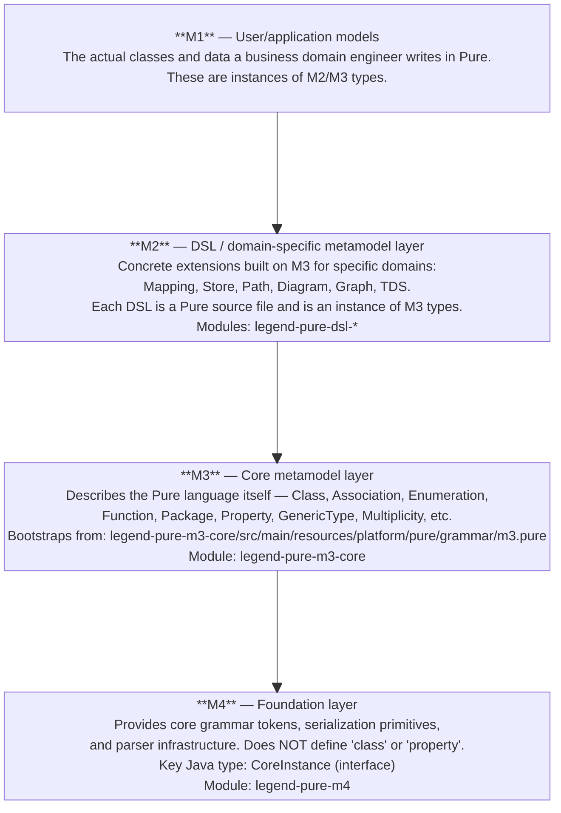
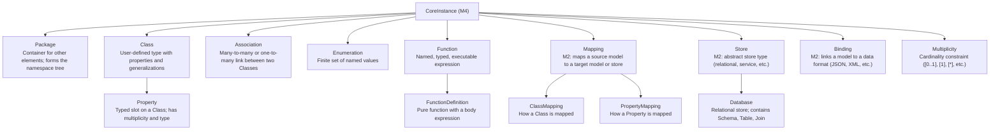

# Domain & Key Concepts

## 1. Core Domain Entities

Legend Pure is a **metamodel-driven** system. Understanding the M4 → M3 → M2 → M1
layer stack is essential to understanding the codebase.

### Metamodel Layer Stack

#### Quick reference — what belongs at each layer

| Layer | Concrete examples | Where defined |
|-------|------------------|---------------|
| **M4** | Grammar tokens, `CoreInstance` interface, serialization format | `legend-pure-m4` (Java + ANTLR) |
| **M3** | `meta::pure::metamodel::type::Class`, `Property`, `GenericType`, `Multiplicity`, `ConcreteFunctionDefinition`, `ValueSpecification`, `Association`, `Enumeration` | `m3.pure` (bootstrapped Pure) |
| **M2 — Mapping** | `meta::pure::mapping::Mapping`, `SetImplementation`, `PropertyMapping`, `EnumerationMapping` | `legend-pure-m2-dsl-mapping-pure` |
| **M2 — Store** | `meta::pure::store::set::SetRelation`, `RelationStoreAccessor` | `legend-pure-m2-dsl-store-pure` |
| **M2 — Path** | `meta::pure::metamodel::path::Path`, `PropertyPathElement`, `CastPathElement` | `legend-pure-m2-dsl-path-pure` |
| **M2 — TDS** | `meta::pure::metamodel::relation::TDS`, `TDSRelationAccessor` | `legend-pure-m2-dsl-tds-pure` |
| **M2 — Diagram** | `meta::pure::diagram::DiagramNode`, `RectangleGeometry`, `LineStyle` | `legend-pure-m2-dsl-diagram-pure` |
| **M2 — Graph** | `meta::pure::graphFetch::GraphFetchTree`, `RootGraphFetchTree`, `PropertyGraphFetchTree` | `legend-pure-m2-dsl-graph-pure` |
| **M1** | `my::domain::Trade`, `my::domain::Product`, any user-written Pure class | User `.pure` files in a repository |

#### Key M3 types (defined in `m3.pure`)

These are the types the compiler uses to represent every element of a Pure program.
When you navigate a `CoreInstance` graph in Java, these are the types you encounter:

| M3 Type | Full path | Purpose |
|---------|-----------|---------|
| `Class` | `meta::pure::metamodel::type::Class` | Represents a class definition |
| `Property` | `meta::pure::metamodel::function::property::Property` | Typed slot on a class |
| `GenericType` | `meta::pure::metamodel::type::generics::GenericType` | Parameterised type reference |
| `Multiplicity` | `meta::pure::metamodel::multiplicity::Multiplicity` | Cardinality constraint (`[1]`, `[*]`, …) |
| `ConcreteFunctionDefinition` | `meta::pure::metamodel::function::ConcreteFunctionDefinition` | A Pure function with a body |
| `ValueSpecification` | `meta::pure::metamodel::valuespecification::ValueSpecification` | Any expression / value node |
| `Association` | `meta::pure::metamodel::relationship::Association` | Bidirectional class relationship |
| `Enumeration` | `meta::pure::metamodel::type::Enumeration` | Finite set of named values |

#### M2 DSL module pattern

Every DSL in `legend-pure-dsl-*` follows the same base layout of three sub-modules,
with some DSLs adding a fourth for interpreted-mode support:

| Sub-module suffix | Present in | Contents |
|-------------------|-----------|---------|
| `-pure` | All DSLs | The DSL's type definitions as Pure source (`*.pure`). This is the M2 metamodel itself. |
| `-grammar` | All DSLs | ANTLR4 grammar and Java parser for the DSL's concrete syntax (e.g. `###Mapping` sections). |
| `-runtime-java-extension-compiled-*` | All DSLs | Java code-generation support for the compiled execution engine. |
| `-runtime-java-extension-interpreted-*` | Path, TDS only | Native function implementations for the interpreted execution engine. |

### Key Entity Relationships

### Pure Primitive Types

| Pure Type | Java type | Notes |
|-----------|-----------|-------|
| `String` | `String` | Unicode string |
| `Integer` | `long` / `Long` | 64-bit integer |
| `Float` | `double` / `Double` | 64-bit floating point |
| `Decimal` | `BigDecimal` | Arbitrary precision (precisePrimitives module) |
| `Boolean` | `boolean` / `Boolean` | |
| `Date` | `PureDate` | Legend-specific date type (includes strict date, datetime) |
| `StrictDate` | `PureDate` | Calendar date without time |
| `DateTime` | `PureDate` | Date + time |
| `Number` | *(abstract)* | Supertype of `Integer`, `Float`, `Decimal` |
| `Any` | *(abstract)* | Root type; every Pure type is a subtype |

---

## 2. Glossary

| Term | Definition |
|------|-----------|
| **Pure** | The functional, strongly-typed programming language at the heart of Legend. Source files have the `.pure` extension. |
| **CoreInstance** | The universal node type in the Pure runtime object graph. Everything parsed or compiled is a `CoreInstance`. |
| **M4 / M3 / M2 / M1** | Metamodel layers; see section 1 above. |
| **Repository** | A named collection of Pure source files compiled together. Each module defines one or more repositories via `*.definition.json` files. |
| **PAR file** | Pure ARchive — a binary snapshot of a compiled repository (`.par`). Avoids re-parsing on subsequent starts. |
| **Compiled mode** | Execution strategy where Pure functions are translated to Java classes ahead of time. Faster but requires a build step. |
| **Interpreted mode** | Execution strategy where the runtime tree-walks the Pure AST at execution time. No ahead-of-time code gen; used in IDE and test scenarios. |
| **PCT** | Platform Compatibility Test — a test suite that verifies a given runtime (compiled or interpreted) correctly executes a set of annotated Pure functions. |
| **DSL** | Domain-Specific Language extension to Pure (diagram, graph, mapping, path, store, TDS). |
| **Mapping** | A Pure declaration that describes how one model is transformed into another, or how a model is persisted in / read from a store. |
| **Store** | An abstract data storage back-end. Currently the main concrete store is relational (SQL databases). |
| **TDS** | Tabular Data Set — a row/column result type supporting relational-algebra operations in Pure. |
| **Multiplicity** | Cardinality annotation on properties: `[0..1]`, `[1]`, `[*]` (zero-or-more), `[1..*]`. |
| **Generalization** | Pure's inheritance mechanism (`extends`). Pure supports single-class inheritance but multiple interface-like generalization via `Any`. |
| **Property** | A typed slot on a Pure `Class`. Properties can be primitive or typed with another `Class`. |
| **Qualified property** | A property that takes parameters (essentially a parameterized function on a class). |
| **Lambda** | An anonymous function expression, used heavily in mappings and query expressions. |
| **Graph walk / navigation** | The act of traversing the `CoreInstance` graph using property accessors, common in compiler and runtime code. |
| **ANTLR4 visitor** | The Java class generated from an ANTLR4 grammar that walks the parse tree; the entry point for all grammar-based parsing in the project. |
| **`definition.json`** | A JSON descriptor file that declares a Pure repository's name, dependencies on other repositories, and the set of Pure source files it contains. |
| **PCT report** | A JSON file listing which PCT-annotated Pure functions pass or fail on a given runtime. |

---

## 3. Key Design Patterns

### Visitor Pattern (Pervasive)

Used throughout the compiler and runtime for processing `CoreInstance` graphs and
ANTLR4 parse trees. Every ANTLR4-generated grammar has a corresponding `*Visitor`
interface; compiler passes implement these interfaces to walk parse trees or
`CoreInstance` graphs.

### Layered Compiler / Multi-Pass Compilation

The M3 compiler operates in multiple ordered passes:

1. **Parse** — ANTLR4 grammar → parse tree.
2. **First pass** — Register package/class/function names (builds symbol table).
3. **Type inference and linking** — Resolve type references across the graph.
4. **Validation** — Check multiplicity, type compatibility, and function signatures.

Each pass is a separate visitor implementation, keeping concerns separated.

### Code Generation Strategy (Template + AST Walk)

The `JavaCodeGeneration` and `M3CoreInstanceGenerator` classes walk the M3
`CoreInstance` graph and emit Java source text using string templates (not a
formal template engine). Generated files land in `target/generated-sources/`.

### Repository + PAR Caching

The `PureJarGenerator` serializes compiled repositories into `.par` archives.
At runtime (or in the next build), `PureCompilerLoader` reads these archives
instead of re-parsing source, enabling fast startup in production and incremental
builds in CI.

### Plugin Delegation Pattern (Maven Plugins)

Every custom Maven plugin (`legend-pure-maven-*`) follows the same structure:

1. Resolve the Maven project's dependency URLs into a `URLClassLoader`.
2. Set it as the thread-context classloader.
3. Delegate to a static method in the core/runtime modules.
4. Restore the original classloader.

This keeps the plugin layer thin and the business logic in the library modules
where it is easily unit-tested.

### Enforced Dependency Convergence

`maven-enforcer-plugin` with `<dependencyConvergence/>` ensures that no two
transitive paths resolve to different versions of the same library. All versions
must converge to a single value, declared in the root `<dependencyManagement>`.

### Milestoning (Bitemporal Compiler Transformation)

Milestoning is a first-class compiler feature for **bitemporal data modelling** — a
common pattern in financial systems where every fact must be recorded against both
the date it was true in the real world (business date) and the date the system
learned about it (processing date).

When a Pure `Class` carries one of the three milestoning stereotypes, the M3
post-processor (`MilestoningClassProcessor`) rewrites the class at compile time:

| Stereotype | Dates added | Generated properties |
|-----------|-------------|---------------------|
| `@BusinessTemporal` | `businessDate` | `allVersions`, `allVersionsInRange` |
| `@ProcessingTemporal` | `processingDate` | `allVersions`, `allVersionsInRange` |
| `@BiTemporal` | `businessDate` + `processingDate` | All of the above |

All navigations *to* a milestoned class are also rewritten to require the appropriate
date arguments, enforcing temporal correctness across the entire model at compile time
rather than at query time.

The implementation lives in:
`legend-pure-core/legend-pure-m3-core/src/main/java/org/finos/legend/pure/m3/compiler/postprocessing/processor/milestoning/`

---

## 4. Key Java Packages — Orientation Map

When navigating the Java source for the first time, use this table to orient yourself:

### `legend-pure-m3-core` (`org.finos.legend.pure.m3.*`)

| Package | What lives here |
|---------|----------------|
| `m3.compiler.postprocessing` | Multi-pass compiler: type inference, function matching, visibility |
| `m3.compiler.postprocessing.processor.milestoning` | Bitemporal milestoning rewrite rules |
| `m3.compiler.validation` | Validation passes: type compatibility, multiplicity, function signatures |
| `m3.compiler.unload` | Incremental compilation: unbind and walk passes for removing elements |
| `m3.coreinstance` | Generated `CoreInstance` accessor interfaces and implementations (do not edit by hand) |
| `m3.navigation` | Utilities for traversing the `CoreInstance` graph (property access, type navigation) |
| `m3.pct` | PCT annotation support and function-index infrastructure |
| `m3.serialization` | PAR serializer/deserializer and binary `PureCompilerBinaryGenerator` |
| `m3.statelistener` | Compiler state listener interfaces for progress reporting |
| `m3.tools` | General-purpose utility classes |
| `m3.execution` | `FunctionExecution` interface — the bridge between compiler and runtime |
| `m3.generator` | Bootstrap code-generation utilities |

### `legend-pure-runtime-java-engine-compiled` (`org.finos.legend.pure.runtime.java.compiled.*`)

| Package | What lives here |
|---------|----------------|
| `compiled.execution` | `CompiledExecutionSupport`, `FunctionExecutionCompiled` — main entry points |
| `compiled.generation` | `JavaCodeGeneration` and orchestration classes |
| `compiled.compiler` | In-memory `javax.tools` Java compiler wrapper |
| `compiled.serialization` | `DistributedBinaryGraphSerializer` — binary metadata writer |
| `compiled.metadata` | `MetadataAccessor` — runtime metadata lookup |
| `compiled.extension` | `CompiledExtension` interface — how DSL/store extensions register |
| `compiled.factory` | Generated factory classes for `CoreInstance` creation |
| `compiled.delta` | Incremental (delta) compilation support for IDE scenarios |
| `compiled.testHelper` | Test utilities for compiled-mode tests |

---

## 5. Cross-Cutting Concerns

### Security Model

- No authentication or authorization is built into Legend Pure itself; security is
  the responsibility of higher-level Legend components (Legend Engine, Legend Studio).
- BouncyCastle is available for cryptographic operations (PGP signing).
- Banned dependencies: `log4j` (CVE risk), `commons-logging` (replaced by SLF4J bridge).

### Logging Strategy

- **Facade:** SLF4J API (`org.slf4j.Logger`).
- **Bridge:** `jcl-over-slf4j` routes Apache Commons Logging to SLF4J.
- **Backend:** Not provided by this library; consuming applications supply an
  SLF4J implementation (e.g. Logback, Log4j2-over-SLF4J).
- **Convention:** Use `LoggerFactory.getLogger(MyClass.class)` — one logger per class.
- **Do NOT log:** Passwords, credentials, PII, or raw SQL containing user data.
- **Do log:** Build progress milestones (`INFO`), unexpected states (`WARN`),
  unrecoverable errors (`ERROR`).

### Error Handling

- **Compiler errors:** Represented as `PureCompilationException` (unchecked), carrying
  `SourceInformation` (file name, start/end line/column). Never swallow compiler
  exceptions.
- **Runtime errors:** `PureExecutionException` wraps execution-time failures.
- **Empty catch blocks:** Only permitted with the variable named `expected` or
  `ignored` (enforced by Checkstyle `EmptyCatchBlock` rule).
- **No `System.exit()`:** Library code must never call `System.exit()`.

### Configuration Management

Legend Pure is a library/build-tool project — it has no runtime configuration files
of its own. Configuration is provided through:

- Maven POM `<configuration>` blocks for plugin parameters.
- `*.definition.json` files that declare Pure repository metadata.
- System properties passed via `-D` flags on the Maven command line or in
  `MAVEN_OPTS`.
