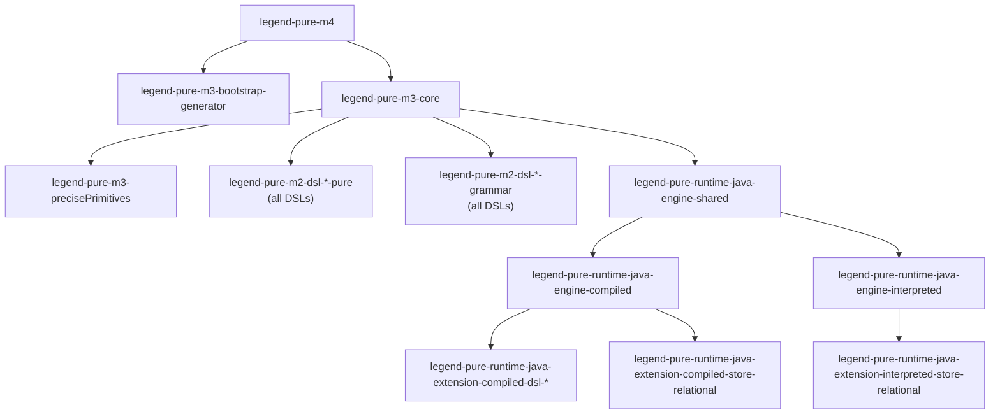

# Module Reference

This page describes every Maven module, its responsibility, its key internal packages,
and its direct compile-scope dependencies on other modules in the project.

---

## legend-pure-core

### `legend-pure-m4`

| | |
|---|---|
| **Artifact** | `org.finos.legend.pure:legend-pure-m4` |
| **Packaging** | `jar` |
| **Description** | The lowest-level metamodel layer. Defines `CoreInstance` (the universal node type in the Pure object graph), serialization primitives, and the ANTLR4 grammar used for the binary/text exchange format. All other modules depend on this. |
| **Key packages** | `org.finos.legend.pure.m4.coreinstance`, `org.finos.legend.pure.m4.serialization` |
| **ANTLR4 grammars** | `M4Parser.g4`, shared fragments in `core/` |
| **Internal deps** | *(none — foundation module)* |

---

### `legend-pure-m3-bootstrap-generator`

| | |
|---|---|
| **Artifact** | `org.finos.legend.pure:legend-pure-m3-bootstrap-generator` |
| **Packaging** | `jar` |
| **Description** | A build-time-only code generator that bootstraps the M3 metamodel Java classes before the rest of the build runs. Produces the initial set of strongly-typed `CoreInstance` wrappers used to represent M3 metamodel elements in Java. |
| **Internal deps** | `legend-pure-m4` |

---

### `legend-pure-m3-core`

| | |
|---|---|
| **Artifact** | `org.finos.legend.pure:legend-pure-m3-core` |
| **Packaging** | `jar` |
| **Description** | The heart of Legend Pure. Contains: the Pure language ANTLR4 grammar, the full M3 compiler (parsing → type-checking → linking), the Pure standard library (`.pure` resources), serialization (PAR format), the `PureJarGenerator`, and the binary `PureCompilerBinaryGenerator`. |
| **Key packages** | `org.finos.legend.pure.m3.compiler`, `org.finos.legend.pure.m3.serialization`, `org.finos.legend.pure.m3.coreinstance` (generated) |
| **ANTLR4 grammars** | `M3.g4` and shared `core/` fragments |
| **Internal deps** | `legend-pure-m4`, `legend-pure-m3-bootstrap-generator` |

> **Note:** The compiler executes in two passes during the Maven build. First, the
> `maven-compiler-plugin` compiles the non-generated Java source; then the
> `legend-pure-maven-generation-platform-java` plugin generates `CoreInstance` accessors;
> then `maven-compiler-plugin` runs again (`process-classes` phase) to compile those
> generated files.

---

### `legend-pure-m3-precisePrimitives`

| | |
|---|---|
| **Artifact** | `org.finos.legend.pure:legend-pure-m3-precisePrimitives` |
| **Packaging** | `jar` |
| **Description** | Adds arbitrary-precision numeric primitives (e.g. `BigDecimal`-backed types) to the Pure type system. Compiled via `legend-pure-maven-compiler` and packaged as a PAR via `legend-pure-maven-generation-par`. |
| **Internal deps** | `legend-pure-m4`, `legend-pure-m3-core` |

---

## legend-pure-dsl

Each DSL sub-module follows an identical three-part pattern:

| Sub-module suffix | Role |
|---|---|
| `-pure` | Pure-language source files defining the DSL's metaclasses and functions |
| `-grammar` | ANTLR4 grammar + Java visitor/listener classes; the grammar parser |
| `-runtime-java-extension-compiled-*` | Java extension registered with the compiled engine |

### `legend-pure-dsl-diagram`

Provides a UML-style class diagram DSL. Allows Pure classes and associations to be
laid out and visualized. No execution semantics; purely a presentation concern.

**Internal deps (grammar):** `legend-pure-m4`, `legend-pure-m3-core`

---

### `legend-pure-dsl-graph`

Property-graph DSL — enables graph-oriented traversal and query patterns over
Pure class graphs.

**Internal deps (grammar):** `legend-pure-m4`, `legend-pure-m3-core`

---

### `legend-pure-dsl-mapping`

Model-to-model and model-to-store **mapping** DSL. This is the most heavily used DSL
in the Legend platform — it describes how one class model maps to another (or to a
relational store, a service, etc.).

**Internal deps (grammar):** `legend-pure-m4`, `legend-pure-m3-core`, `legend-pure-m2-dsl-store-grammar`

---

### `legend-pure-dsl-path`

Property-**path** expression DSL. Enables navigating the class graph using dot-notation
paths (e.g. `$person.address.city`) as first-class values.

**Internal deps (grammar):** `legend-pure-m4`, `legend-pure-m3-core`

---

### `legend-pure-dsl-store`

Abstract **store** DSL — the shared vocabulary for all store types (relational,
service, etc.). Provides the `Store`, `Binding`, and `Connection` metamodel elements.

**Internal deps (grammar):** `legend-pure-m4`, `legend-pure-m3-core`

---

### `legend-pure-dsl-tds`

**Tabular Data Set** (TDS) DSL. Provides relational-algebra-style operations
(`filter`, `project`, `join`, `groupBy`, etc.) on in-memory tabular results.

**Internal deps (grammar):** `legend-pure-m4`, `legend-pure-m3-core`

---

## legend-pure-maven

### `legend-pure-maven-shared`

Shared utility JAR (not a plugin). Provides:

- `DependencyResolutionScope` — enum modelling Maven dependency scopes.
- `ProjectDependencyResolution` — resolves project dependency URLs from Maven resolver
  API; determines correct scope from current lifecycle phase.

**Internal deps:** `legend-pure-m4`, `legend-pure-m3-core`

---

### `legend-pure-maven-compiler`

**Goal:** `compile-pure` (default phase: `compile`)

Compiles Pure source files and writes binary element files consumed by
`PureCompilerLoader`. Supports both monolithic and per-repository compilation.

Delegates to: `PureCompilerBinaryGenerator.serializeModules()`

**Internal deps:** `legend-pure-m4`, `legend-pure-m3-core`, `legend-pure-maven-shared`

---

### `legend-pure-maven-generation-java`

**Goal:** `build-pure-compiled-jar`

Generates Java source from the compiled Pure model and optionally compiles it to
`.class` files. Supports `monolithic` and `modular` strategies.

Delegates to: `JavaCodeGeneration.doIt()`

**Internal deps:** `legend-pure-runtime-java-engine-compiled`, `legend-pure-m3-core`

---

### `legend-pure-maven-generation-par`

**Goal:** `build-pure-jar`

Produces PAR (Pure Archive) files — the binary snapshot cache of compiled Pure
repositories. Used to skip re-parsing on subsequent builds.

Delegates to: `PureJarGenerator.doGeneratePAR()`

**Internal deps:** `legend-pure-m3-core`, `legend-pure-maven-shared`

---

### `legend-pure-maven-generation-platform-java`

**Goal:** `generate-m3-core-instances` (default phase: `compile`)

Generates strongly-typed Java accessor/implementation/wrapper/lazy-loader classes
from the M3 metamodel. These generated files are the foundational `CoreInstance`
Java types.

Delegates to: `M3CoreInstanceGenerator.generate()`

**Internal deps:** `legend-pure-runtime-java-engine-compiled`, `legend-pure-m3-core`

---

### `legend-pure-maven-generation-pct`

**Goals:** `generate-pct-functions`, `generate-pct-report`

PCT = Platform Compatibility Testing. Introspects the compiled Pure model for
`@PCT`-annotated functions, writes a JSON function index, and runs PCT test suites
against compiled or interpreted runtimes.

**Internal deps:** `legend-pure-runtime-java-engine-compiled`, `legend-pure-runtime-java-engine-interpreted`

---

## legend-pure-runtime

### `legend-pure-runtime-java-engine-shared`

Shared utilities used by both the compiled and interpreted engines:
base execution context, HTTP utility wrappers, shared exception types.

**Internal deps:** `legend-pure-m4`, `legend-pure-m3-core`

---

### `legend-pure-runtime-java-engine-compiled`

The **compiled (AOT) Java engine**. Executes Pure functions using pre-generated Java
classes. Key classes: `CompiledExecutionSupport`, `JavaModelFactoryGenerator`,
`DistributedBinaryGraphSerializer`.

During the Maven build this module uses `exec-maven-plugin` to run
`JavaModelFactoryGenerator` at `generate-sources` phase, then re-runs
`maven-compiler-plugin` at `process-classes` to compile the output.

**Internal deps:** `legend-pure-runtime-java-engine-shared`, `legend-pure-m3-core`

---

### `legend-pure-runtime-java-engine-interpreted`

The **tree-walking interpreter**. Parses and executes Pure source at runtime without
a Java code-generation step. Used in development / IDE scenarios and for PCT testing.
Generates a PCT report during `process-test-classes` via `exec-maven-plugin`.

**Internal deps:** `legend-pure-runtime-java-engine-shared`, `legend-pure-m3-core`

---

## legend-pure-store

### `legend-pure-store-relational`

| Sub-module | Role |
|---|---|
| `legend-pure-m2-store-relational-pure` | Pure model for tables, joins, schemas, databases |
| `legend-pure-m2-store-relational-grammar` | ANTLR4 grammar for the relational DSL |
| `legend-pure-runtime-java-extension-shared-store-relational` | Engine-agnostic SQL generation and execution utilities; H2 and DuckDB JDBC drivers |
| `legend-pure-runtime-java-extension-compiled-store-relational` | Compiled-engine integration |
| `legend-pure-runtime-java-extension-interpreted-store-relational` | Interpreted-engine integration |

**Internal deps:** `legend-pure-m3-core`, `legend-pure-dsl-mapping-*`, `legend-pure-runtime-java-engine-*`

---

## Dependency Graph (Simplified)

---

*Back: [Architecture Overview](overview.md) · Next: [Technology Stack](tech-stack.md)*
