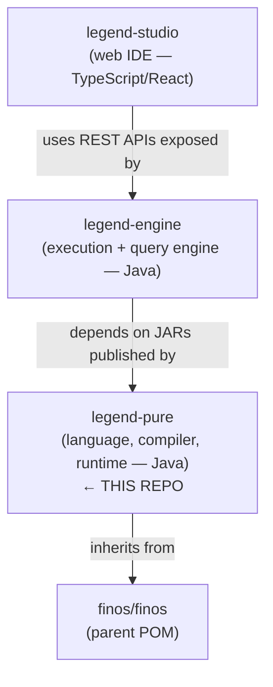

# Project Overview & Architecture

## 1. What is Legend Pure?

Legend Pure is the **language and compiler engine that powers the
[FINOS Legend](https://legend.finos.org/) platform** — an open-source data management
and governance suite originally developed at Goldman Sachs.

### The Problem it Solves

Financial firms manage data spread across dozens of systems with inconsistent schemas,
naming conventions, and semantics. Connecting those systems typically requires
hand-crafted ETL code that is tightly coupled to specific technology, duplicated
independently in every team, and impossible to version or audit as a first-class
artefact.

Legend Pure solves this by providing a **single, technology-agnostic, strongly-typed
language** — called *Pure* — in which domain experts describe *what* data is and *how*
it relates, without coupling that description to any particular database or framework.
The platform then generates the necessary connectors, validators, and transformations.

### What Legend Pure Provides

- A **strongly-typed, functional programming language** (Pure) for defining the
  financial domain model, transformations, mappings, and queries across the entire
  Legend platform.
- A **compiler pipeline** that parses Pure source, builds an in-memory M3/M4 metamodel
  graph, and generates Java source and bytecode for two execution targets:
  - **Compiled mode** — ahead-of-time Java code generation for production performance.
  - **Interpreted mode** — runtime tree-walking interpreter for rapid development and
    debugging.
- A set of **DSL extensions** that add first-class syntax for mappings, paths,
  diagrams, graphs, tabular data sets (TDS), and relational stores.
- A **Maven plugin suite** that drives the above pipeline during the normal Maven build
  lifecycle so that Pure code is compiled and Java stubs are generated before
  `maven-compiler-plugin` runs.

---

## 2. Position in the Legend Ecosystem

Legend Pure is the **lowest layer** of a stack of separate FINOS repositories, each
of which depends on the one below it:



| Repo | What it is | Relationship to legend-pure |
|------|-----------|----------------------------|
| **[finos/legend-pure](https://github.com/finos/legend-pure)** | This repo — language, compiler, runtime | — |
| **[finos/legend-engine](https://github.com/finos/legend-engine)** | Execution engine, REST API layer, store connectors, service execution | Declares `legend-pure-*` JARs as compile dependencies; extends the Pure compiler and runtime with engine-specific behaviour |
| **[finos/legend-sdlc](https://github.com/finos/legend-sdlc)** | Model versioning and SDLC backend | Depends on legend-engine (and transitively on legend-pure) for model compilation |
| **[finos/legend-studio](https://github.com/finos/legend-studio)** | Browser-based IDE for writing Pure models | Calls legend-engine REST endpoints; never directly depends on legend-pure JARs |

### What this means in practice

- **Public Java API changes are breaking for legend-engine.** Classes and interfaces
  in `legend-pure-m4`, `legend-pure-m3-core`, and the runtime engine modules are
  consumed as a compiled library dependency. Treat them with the same care as a
  library published to Maven Central — because they are.
- **The Maven plugin suite is also a published API.** `legend-pure-maven-*` plugins
  are consumed by legend-engine and any other project that compiles Pure source as
  part of its build. Plugin goal names, parameter names, and default phases are all
  part of the public contract.
- **Releases are coordinated across the stack.** The `legend-stack-release` GitHub
  Actions workflow in this repo is triggered by a `repository_dispatch` event fired
  by the FINOS release orchestration, so that the entire stack
  (legend-pure → legend-engine → legend-sdlc) is released in dependency order with
  compatible version numbers.
- **Store connectors and query execution are not here.** This repo contains only the
  language and compiler foundation. Relational, service, and other store connectors,
  query execution, and the REST API layer all live in legend-engine.

---

## 3. High-Level Architecture

│                          Legend Pure — Component View                        │
│                                                                              │
│  ┌─────────────────────────────┐   ┌────────────────────────────────────┐   │
│  │       Pure Source (.pure)   │   │  Maven Build (legend-pure-maven)   │   │
│  │  platform / DSL / user code │──▶│  compile-pure  build-pure-jar      │   │
│  └─────────────────────────────┘   │  build-pure-compiled-jar           │   │
│                                    │  generate-m3-core-instances        │   │
│                                    │  generate-pct-functions/report     │   │
│                                    └──────────────┬─────────────────────┘   │
│                                                   │                          │
│              ┌────────────────────────────────────▼────────────────────┐    │
│              │                   legend-pure-core                       │    │
│              │                                                          │    │
│              │  ┌──────────────┐  ┌──────────────┐  ┌───────────────┐ │    │
│              │  │  legend-pure │  │ legend-pure  │  │ legend-pure   │ │    │
│              │  │     -m4      │  │  -m3-core    │  │ -m3-bootstrap │ │    │
│              │  │  (Metamodel) │  │  (Language)  │  │  -generator   │ │    │
│              │  └──────┬───────┘  └──────┬───────┘  └───────────────┘ │    │
│              │         │                 │  ┌──────────────────────┐   │    │
│              │         └─────────────────┤  │ legend-pure-m3-      │   │    │
│              │                           │  │ precisePrimitives    │   │    │
│              │                           │  └──────────────────────┘   │    │
│              └────────────────────────────────────────────────────┬───┘    │
│                                                                    │         │
│        ┌───────────────────────────────────────────────────────────▼──────┐ │
│        │                       legend-pure-dsl                             │ │
│        │  diagram · graph · mapping · path · store · tds                  │ │
│        │  (each DSL has: -pure  -grammar  -runtime-compiled extension)    │ │
│        └─────────────────────────────────────────────────────────┬────────┘ │
│                                                                   │          │
│        ┌──────────────────────────────────────────────────────────▼───────┐ │
│        │                    legend-pure-runtime                            │ │
│        │  shared ──▶ compiled engine  (ahead-of-time Java codegen)        │ │
│        │         ──▶ interpreted engine (tree-walking interpreter)         │ │
│        └──────────────────────────────────────────────────────────────────┘ │
│                                                                              │
│        ┌──────────────────────────────────────────────────────────────────┐ │
│        │              legend-pure-store (relational)                       │ │
│        │  pure model · grammar · runtime extensions (compiled/interpreted)│ │
│        └──────────────────────────────────────────────────────────────────┘ │
└──────────────────────────────────────────────────────────────────────────────┘

```text

### Data / Compilation Flow

```text
Pure source files
      │
      ▼
[ANTLR4 grammar] ──▶ Parse tree
      │
      ▼
[M3 Compiler] ──▶ In-memory CoreInstance graph (M3/M4 metamodel)
      │
      ├──▶ [PAR serializer] ──▶ .par archive files (build cache)
      │
      ├──▶ [Binary compiler] ──▶ binary element files (PureCompilerLoader)
      │
      └──▶ [Java code generator] ──▶ Java source + .class files
                                          │
                                          ▼
                              Compiled runtime (high performance)
                              Interpreted runtime (dev / debug)

```text

---

## 4. Multi-Module Maven Structure

The root POM aggregates **five top-level Maven modules**, each of which is itself an
aggregator with leaf jar modules:

```text
legend-pure  (root aggregator, groupId: org.finos.legend.pure, version: 5.79.1-SNAPSHOT)
│
├── legend-pure-core          Core language and metamodel
│   ├── legend-pure-m4                  Low-level metamodel primitives (CoreInstance, etc.)
│   ├── legend-pure-m3-bootstrap-generator  Boot-strap code generator (used during build)
│   ├── legend-pure-m3-core             Main Pure language compiler & standard library
│   └── legend-pure-m3-precisePrimitives  Precise numeric primitive types
│
├── legend-pure-dsl           Domain-Specific Language extensions
│   ├── legend-pure-dsl-diagram         UML-style diagram DSL
│   │   ├── legend-pure-m2-dsl-diagram-pure
│   │   ├── legend-pure-m2-dsl-diagram-grammar
│   │   └── legend-pure-runtime-java-extension-compiled-dsl-diagram
│   ├── legend-pure-dsl-graph           Property-graph DSL
│   │   ├── legend-pure-m2-dsl-graph-pure
│   │   ├── legend-pure-m2-dsl-graph-grammar
│   │   └── legend-pure-runtime-java-extension-compiled-dsl-graph
│   ├── legend-pure-dsl-mapping         Model-to-model and model-to-store mapping DSL
│   │   ├── legend-pure-m2-dsl-mapping-pure
│   │   ├── legend-pure-m2-dsl-mapping-grammar
│   │   └── legend-pure-runtime-java-extension-compiled-dsl-mapping
│   ├── legend-pure-dsl-path            Property-path expression DSL
│   │   ├── legend-pure-m2-dsl-path-pure
│   │   ├── legend-pure-m2-dsl-path-grammar
│   │   └── legend-pure-runtime-java-extension-compiled-dsl-path
│   ├── legend-pure-dsl-store           Abstract store DSL (basis for relational, etc.)
│   │   ├── legend-pure-m2-dsl-store-pure
│   │   ├── legend-pure-m2-dsl-store-grammar
│   │   └── legend-pure-runtime-java-extension-compiled-dsl-store
│   └── legend-pure-dsl-tds             Tabular Data Set DSL
│       ├── legend-pure-m2-dsl-tds-pure
│       ├── legend-pure-m2-dsl-tds-grammar
│       └── legend-pure-runtime-java-extension-compiled-dsl-tds
│
├── legend-pure-maven         Maven plugins that drive the build pipeline
│   ├── legend-pure-maven-shared                 Shared dependency-resolution utilities
│   ├── legend-pure-maven-compiler               compile-pure goal
│   ├── legend-pure-maven-generation-java        build-pure-compiled-jar goal
│   ├── legend-pure-maven-generation-par         build-pure-jar (PAR) goal
│   ├── legend-pure-maven-generation-platform-java  generate-m3-core-instances goal
│   └── legend-pure-maven-generation-pct         PCT report generation goals
│
├── legend-pure-runtime       Java execution engines
│   ├── legend-pure-runtime-java-engine-shared   Common runtime utilities
│   ├── legend-pure-runtime-java-engine-compiled Compiled (AOT) Java engine
│   └── legend-pure-runtime-java-engine-interpreted  Tree-walking interpreter
│
└── legend-pure-store         Relational store support
    └── legend-pure-store-relational
        ├── legend-pure-m2-store-relational-pure
        ├── legend-pure-m2-store-relational-grammar
        ├── legend-pure-runtime-java-extension-shared-store-relational
        ├── legend-pure-runtime-java-extension-compiled-store-relational
        └── legend-pure-runtime-java-extension-interpreted-store-relational
```

### Module Naming Conventions

| Prefix | Meaning |
|--------|---------|
| `legend-pure-m4-*` | Core metamodel layer (CoreInstance, serialization) |
| `legend-pure-m3-*` | Pure language layer (parser, compiler, standard library) |
| `legend-pure-m2-dsl-*-pure` | Pure-language definitions of a DSL extension |
| `legend-pure-m2-dsl-*-grammar` | ANTLR4 grammar + Java parser for a DSL extension |
| `legend-pure-m2-store-*` | Store extension Pure model and grammar |
| `legend-pure-runtime-java-engine-*` | Core Java execution engines |
| `legend-pure-runtime-java-extension-compiled-*` | Compiled-engine Java extension for a DSL/store |
| `legend-pure-runtime-java-extension-interpreted-*` | Interpreted-engine extension for a DSL/store |
| `legend-pure-runtime-java-extension-shared-*` | Shared (engine-agnostic) extension utilities |
| `legend-pure-maven-*` | Maven plugin or plugin utility |

---

## 5. Maven Build Lifecycle Customizations

### Key Plugins Registered in the Root POM

| Plugin | Registered phase | Purpose |
|--------|-----------------|---------|
| `legend-pure-maven-compiler` | `compile` | Compile Pure source → binary elements |
| `legend-pure-maven-generation-par` | bound explicitly | Compile Pure source → PAR archives |
| `legend-pure-maven-generation-java` | bound explicitly | Generate Java source from Pure model |
| `legend-pure-maven-generation-platform-java` | `compile` | Generate M3 `CoreInstance` Java types |
| `legend-pure-maven-generation-pct` | bound explicitly | Generate PCT function index and reports |
| `maven-checkstyle-plugin` | `verify` | Enforce `checkstyle.xml` coding standards |
| `jacoco-maven-plugin` | `test` / `prepare-agent` | Code-coverage instrumentation and reports |
| `maven-dependency-plugin` | `test-compile` | Detect unused / undeclared dependencies |
| `maven-enforcer-plugin` | `validate` | Require Java 11 or 17; ban unwanted logging JARs; enforce dependency convergence |
| `build-helper-maven-plugin` | `initialize` | Register `target/generated-sources/` as compile source root |

### Profiles

| Profile ID | Purpose |
|-----------|---------|
| `sonar` | Activated on `master` CI runs; passes Sonar token and enables SonarCloud analysis |

### JaCoCo Exclusions

Generated ANTLR4 parser classes and generated `CoreInstance` Java types are excluded
from coverage reporting (see `<excludes>` in root POM) because they are machine-generated
code, not hand-written logic.

---

*Next: [Module Reference](modules.md)*
