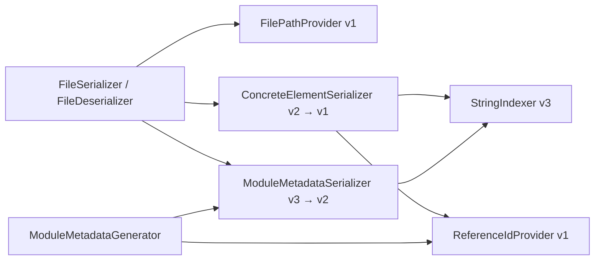
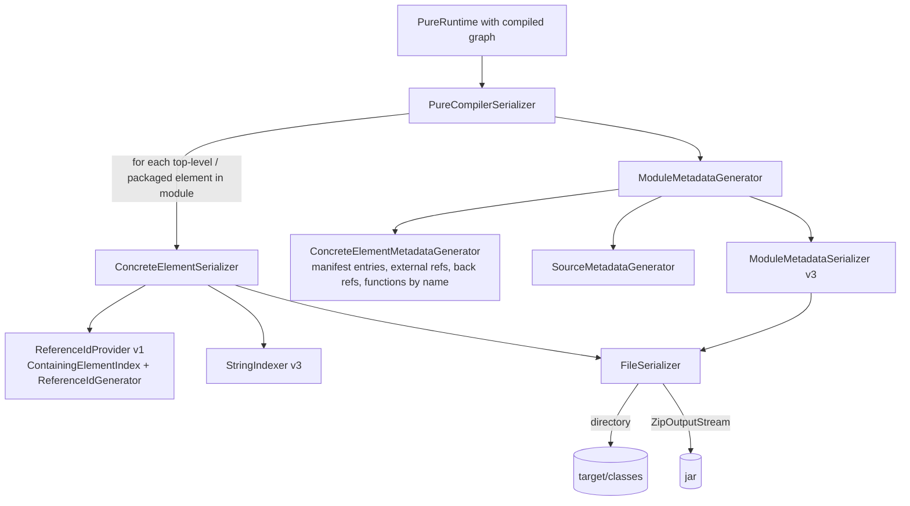

# PELT — Pure Element Serialization

PELT (**P**ure **El**emen**t**) is the binary format in which a compiled Pure graph is
written to disk one *packageable element* at a time, together with per-module metadata
that lets a runtime discover, index, and lazily load those elements without
re-parsing any `.pure` source. It is produced by the `compile-pure` Maven goal
(`legend-pure-maven-compiler`), lands in `target/classes/` of every `*-pure` module,
and is consumed by both execution engines: the compiled engine through
`MetadataPelt`, and the interpreted engine through `PureCompilerLoader`.

This document describes the design, the on-disk layout, the byte-level format of each
file type, the reference-id scheme that links elements together, and the loading
machinery. All code lives under
`legend-pure-core/legend-pure-m3-core/src/main/java/org/finos/legend/pure/m3/serialization/compiler/`
unless stated otherwise.

> **Status (October 2026).** PELT was introduced in September 2025 (#1084) and has
> since gained per-file compression (#1217), a back-reference index (#1237), atomic
> write-if-modified output (#1235), replaced the compiled engine's distributed
> metadata (#1260, removed in #1311), and is the production metadata path of
> `legend-engine` (`PureModel.METADATA_LAZY` is a `MetadataPelt`, engine #4699).
> It coexists with the older PAR archive format during migration.

---

## 1. Why PELT exists

Legend Pure has had two earlier binary representations:

| Format | Where | Granularity | Consumer |
|---|---|---|---|
| **PAR** (`.par`, M4 `BinaryRepositorySerializer`) | `legend-pure-m4` / `legend-pure-maven-generation-par` | one archive per repository, whole graph, node ids are counters | interpreted runtime graph cache (`PureRepositoryJar`, `GraphLoader`) |
| **Distributed metadata** (removed on `master` in #1311) | compiled runtime | per-repository binary metadata behind the old `MetadataLazy` | compiled engine, replaced by `MetadataPelt` (#1260); `MetadataLazy` survives only as a deprecated shim |
| **PELT** | `m3-core` `serialization/compiler` | one file per packageable element + per-module metadata, string reference ids | both engines |

Both older formats force the consumer to deserialize large blobs whose internal ids are
only meaningful relative to that blob. PELT was designed around four requirements:

1. **Element granularity.** The unit of (de)serialization is a single packageable
   element (`Class`, `ConcreteFunctionDefinition`, `Enumeration`, `Profile`, `Mapping`,
   `Database`, …). A runtime that needs `meta::pure::functions::collection::map` reads
   one small file.
2. **Stable, build-independent identity.** Cross-element links are strings derived
   from the element path plus a navigation path inside the element (§6), not arena
   indexes or counters. Two independent builds of the same source produce the same ids.
3. **Lazy loading that is sound.** The bidirectional links that the M3 graph
   maintains (`specializations`, `applications`, `referenceUsages`,
   `propertiesFromAssociations`, …) would otherwise force every element to pull in the
   whole graph. PELT strips them from the element and precomputes them into
   per-module side tables, so loading one element never requires loading its users.
4. **Schema-agnostic.** The serializer never special-cases `Class` or
   `FunctionExpression`. It walks `class_getSimplePropertiesByName(classifier)` and
   writes `(property name → values)`. Any M3 class — including DSL metamodels defined
   in Pure such as `Mapping` or `Database` — serializes identically, and a new DSL
   needs no serializer change.

---

## 2. Vocabulary

| Term | Meaning |
|---|---|
| **Module** | A code repository (`platform`, `core`, `core_relational`, …). The welcome file / un-repositoried sources form the pseudo-module `root` (`ModuleHelper.ROOT_MODULE_NAME`). Module membership is derived from the element's `SourceInformation.sourceId` (`CompositeCodeStorage.getSourceRepoName`). |
| **Concrete element** | A `PackageableElement` with source information. Gets its own `.pelt` file. Packages with source info and primitive types count too (`Root.pelt`, `meta.pelt`, `Integer.pelt` exist). |
| **Virtual package** | A package that no source declares but which is implied by element paths (e.g. `meta::pure` when only `meta::pure::functions::…` elements exist). Not serialized; reconstructed from the manifest by `PackageIndex` (`VirtualPackageMetadata`). |
| **Component instance** | Any non-primitive `CoreInstance` reachable from a concrete element whose `SourceInformation` is lexically subsumed by the element's span: properties, qualified properties, every `ValueSpecification`, `GenericType`, `Multiplicity`, `TaggedValue`, stubs, … Serialized inline in the owner's `.pelt`. |
| **Internal / external** | A node is *internal* to element `E` if it is `E` itself, or its source info is subsumed by `E`'s. Packages (no source info) are always external; other nodes without source info are internal. (`SerializerV1.isExternal`, `ReferenceIdGenerator.Generator.isInternal`.) |
| **Reference id** | The string identity of an instance across files: the element path for a concrete element, a `GraphPath` description for a component instance (§6). |
| **Back reference** | A reverse link from an instance to something in *another* element that points at it: an application of a function, a specialization of a class, a property contributed to a class by an association, a reference usage. Stored in `.pbr` files (§7.4). |

---

## 3. On-disk layout

A PELT output directory (or jar) contains:

```
<output root>/
├── Root.pelt                                   ← package `Root` (path "::")
├── Integer.pelt, String.pelt, …                ← primitive types (top-level elements)
├── meta.pelt                                   ← package `meta`
├── meta/pure.pelt                              ← package `meta::pure`
├── meta/pure/functions/collection/map_T_MANY__Function_1__V_MANY_.pelt
├── meta/pure/metamodel/type/Class.pelt
├── …                                           ← one file per concrete element
└── org/finos/legend/pure/module/
    ├── platform.pmf                            ← module manifest
    ├── platform.psr                            ← source metadata
    ├── platform.pxr                            ← external references
    ├── platform.pfn                            ← functions by name
    ├── platform.pbr                            ← back-reference index (which elements have .pbr files)
    └── platform/
        └── meta/pure/metamodel/type/Class.pbr  ← back references *into* meta::pure::metamodel::type::Class
```

Rules (`FilePathProviderExtensionV1`, `FilePathTools`):

- The element file path is the element's user path split on `::`, each segment a
  directory, plus `.pelt`. Functions are named by their **mangled signature**
  (`at_T_MANY__Integer_1__T_1_`), which is the instance name of the function.
- The root package (path `::`) maps to `Root.pelt`.
- Every segment is capped at 126 characters (so the UTF-16 byte length stays under
  255 for every file system). A longer segment is truncated and the overflow replaced
  by a base-32 hash of the removed text; the extension is never truncated.
- Module metadata files live under `org/finos/legend/pure/module/`; per-element
  back-reference files mirror the element path under `…/module/<module>/`.
- The same names are used as jar entry names when serializing to a `ZipOutputStream`.

Measured on this repository's platform module (`legend-pure-m3-core/target/classes`,
tests included): 1,894 `.pelt` files totalling 3.55 MB; the largest element is 40 KB;
`platform.pmf/.pxr/.pfn/.psr` are 39 / 42 / 28 / 26 KB.

---

## 4. Versioned layers and the extension mechanism

PELT is five independently versioned layers. Each is a `ServiceLoader` extension
interface with a `version()`; `ExtensibleSerializer` collects every implementation on
the classpath and picks the highest as the default writer. Every file records which
versions wrote it, so a reader dispatches per file and old files stay readable.

| Layer | Extension interface | Versions | Default | Role |
|---|---|---|---|---|
| File paths | `FilePathProviderExtension` | 1 | 1 | element path → file / resource name |
| String index | `StringIndexerExtension` | 0 (no indexing), 1, 2, 3 | 3 | per-file string table |
| Element payload | `ConcreteElementSerializerExtension` | 1, 2 (= 1 + DEFLATE) | 2 | `.pelt` body |
| Module metadata | `ModuleMetadataSerializerExtension` | 1, 2, 3 (= 2 + DEFLATE) | 3 | `.pmf/.psr/.pxr/.pbr/.pfn` bodies |
| Reference ids | `ReferenceIdExtension` | 1 | 1 | id generation + resolution |

Each layer's version number is stored where it matters: the element file header
carries the element-serializer version *and* the reference-id version; each module
metadata file carries the metadata-serializer version; every string-indexed section
starts with the string-indexer version; the `.pxr` and `.pbr` bodies additionally
record the reference-id version their ids were generated with.



---

## 5. Binary primitives

All files are written through the M4 `Writer` (`BinaryWriters.newBinaryWriter`,
`StreamBinaryWriter`), which packs multi-byte integers with a default-order
`java.nio.ByteBuffer`:

| Primitive | Encoding |
|---|---|
| `byte`, `boolean` | 1 byte (`boolean` as 0/1) |
| `short`, `int`, `long` | **big-endian**, 2 / 4 / 8 bytes |
| raw `String` (outside a string index) | `int` byte length + UTF-8 bytes |
| arrays | `int` count + elements |

On top of this, the PELT serializers use *width-coded integers*: a 2-bit code
(`BYTE 00`, `SHORT 01`, `INT 10`, `LONG 11`) chosen from the value's range and stored in
the low bits of a preceding code byte, followed by a 1/2/4/8-byte big-endian value.
The code is computed over a *group* of values (for example all six fields of a
`SourceInformation`) so the group shares one width. **The convention is per layer:**
the element body (`BaseV1`) and the module metadata bodies use `BYTE 00 / SHORT 01 /
INT 10 / LONG 11`; the string index (`strings/v3/BaseStringIndex`) uses the opposite
`INT 00 / SHORT 01 / BYTE 10`.

Compression, where applied (element v2, metadata v3), is **raw DEFLATE** with no zlib
header or trailer (`CompressorPool.borrowDeflater(7, nowrap = true)` /
`DeflaterOutputStream`). A reader needs a raw-inflate decoder, not a zlib or gzip one.

---

## 6. Reference ids

### 6.1 What gets an id

`ReferenceIdGenerator` (v1) assigns ids to:

- every concrete element: its user path, e.g.
  `meta::pure::functions::collection::at_T_MANY__Integer_1__T_1_` (packages without
  source information get their path too);
- every internal, non-stub component instance that has source information, reachable
  from the element through *forward* properties.

Stub instances (`ImportStub`, `PropertyStub`, `EnumStub`, `GrammarInfoStub`) and
instances without source information are traversed but not given ids. Back-reference
properties, `package`, and `children` are never traversed
(`ReferenceIdGenerator.SKIP_PROPERTY_PATHS`).

### 6.2 Generation

A breadth-first walk from the element. Each reachable instance is assigned the
*shortest* `GraphPath` from the element, ties broken by comparing edges position by
position (to-one before keyed before index; strings compared by length, then
lexically; indexes numerically). The walk
skips primitives, skips nodes already on the current path (cycle guard), and uses a
**keyed edge** whenever a to-many property's values can be uniquely indexed by a string
property:

| Classifier of the values | Key property tried |
|---|---|
| `QualifiedProperty` | `id` |
| `Stereotype`, `Tag` | `value` |
| anything with a to-one `String` `name` | `name` (then `id` if both exist) |
| anything with a to-one `String` `id` | `id` |

Keyed edges are what makes ids survive reordering of properties, enum values, or
stereotypes. Index edges are used only when no unique key exists (expression
sequences, parameter values, type arguments, …).

### 6.3 Grammar (`GraphPath` description)

```
referenceId := elementPath edge*
edge        := '.' property                      -- to-one
             | '.' property '[' int ']'          -- to-many at index
             | '.' property '[' quoted ']'       -- to-many keyed by `name`
             | '.' property '[' key '=' quoted ']' -- to-many keyed by another String property
quoted      := '\'' escaped-string '\''          -- StringEscape escaping, '\'' and '\\' escaped
```

Examples (shapes taken from `TestReferenceIdGenerator`):

```
test::Enum.values['VAL1']
test::Class.qualifiedProperties[id='toLeft(String[1])'].expressionSequence[0]
test::Class.qualifiedProperties[id='toLeft(String[1])'].expressionSequence[0].parametersValues[1].genericType.typeArguments[0].rawType.parameters['l']
```

### 6.4 Resolution

`ReferenceIdResolverV1` parses the description, resolves the head element path through
a `packagePathResolver` (in a loader this is `ElementLoader.loadElement`, so resolving
an id into another element loads that element on demand), then walks the edges with
`getValueForMetaPropertyToOne`, `…ToMany().get(i)`, or
`getValueInValueForMetaPropertyToManyWithKey`. `GraphPath` can also render the same
path as a Pure expression (`->at(i)`, `->find(x | $x.id == '…')->toOne()`) for
diagnostics.

---

## 7. File formats

### 7.1 String index (`StringIndexerV3`)

Every file body begins with a string index and then refers to strings by id. This is a
large part of the size reduction in #1217.

```
i32  stringIndexerVersion           (3)
i32  N                               number of table entries
N ×  entry
```

Before the table is written, strings are collected from the whole record, decomposed,
sorted by `(length, natural order)`, and numbered 0..N-1. About 90 **special
strings** (`BaseStringIndex.SPECIAL_STRINGS`) are never written: `null`, the empty string,
`::`, `/`, `.`, the primitive type paths, the most common M3 class paths
(`Class`, `ConcreteFunctionDefinition`, `GenericType`, `ImportGroup`, …), the most
common property names (`genericType`, `multiplicity`, `expressionSequence`,
`rawType`, …), package segments such as `meta`, `pure`, `metamodel`, `functions`,
and the five standard multiplicity paths. They have fixed **negative** ids
(`-(index+1)`).

Each entry is one code byte followed by a payload. The top three bits are the kind,
the low two bits the width code of the following length/count — in this layer
`INT 00 / SHORT 01 / BYTE 10`, not the `BaseV1` convention:

| Kind (bits 7–5) | Payload | Reconstructed value |
|---|---|---|
| `000` simple | length (width-coded) + UTF-8 bytes | the bytes |
| `100` source path | count + count×string-id | `'/' + s0 + '/' + s1 …` (paths starting with `/`) |
| `010` package path | count + count×string-id | `s0 + '::' + s1 …` |
| `001` dot-delimited | count + count×string-id | `s0 + '.' + s1 …` |
| `011` import group | count + count×string-id | `s0 + '_' + s1 …` (`import_…_N` names) |
| `110` bracket-indexed, bits 3–2 = `00` | prefix-id, value-id | `prefix + '[' + value + ']'` |
| `110` bracket-indexed, bits 3–2 = `10` | prefix-id, value-id | `prefix + "['" + value + "']"` |
| `110` bracket-indexed, bits 3–2 = `01` | prefix-id, key-id, value-id | `prefix + '[' + key + "='" + value + "']"` |

Because composite entries reference *other* entries, a reference id such as
`meta::pure::functions::collection::map_T_MANY__Function_1__V_MANY_.expressionSequence[0]`
costs a handful of ids rather than a hundred bytes; the parts are shared with every
other id in the file. Decomposition happens recursively (`processStrings` pushes the
parts back onto the work queue). The sort by length is load-bearing: the reader fills
the table sequentially and a composite entry looks its parts up in the table as it is
read, so every part must have a smaller id than the string that contains it — which
holds because a part is always strictly shorter than the whole.

String ids on the wire are 1, 2, 3 or 4 bytes depending on `N`
(`getStringIdByteWidth`: 1 byte up to `255 − |SPECIAL|` entries, and so on). The byte
value is offset so negative special ids fit: `byte = id + |SPECIAL| + Byte.MIN_VALUE`
for one-byte ids, and the analogous shifts for wider ids.

### 7.2 Element file (`.pelt`)

```
i64  signature = Long.parseLong("PureElement", 36)
i32  elementSerializerVersion         (2)
i32  referenceIdVersion               (1)
---- version 2: everything below is one raw-DEFLATE stream; version 1: uncompressed ----
     string index (§7.1)
str  elementPath                      user path of the concrete element
str  sourceId                         the .pure file that declares it
u8   compileStateBitSetWidth          width code for the bitset ints (6 CompileState values today → BYTE)
i32  nodeCount
nodeCount × node                      node[0] is the concrete element; then BFS order
```

Each **node**:

```
bool hasName          [str name]      false for anonymous instances (ModelRepository anonymous names)
str  classifierPath                   e.g. meta::pure::metamodel::valuespecification::SimpleFunctionExpression
u8   sourceInfoCode                   0x00 = absent; 0x80 | width → 6 width-coded ints:
                                      startLine, startColumn, line, column, endLine, endColumn
                                      (sourceId is the element's, not repeated)
u8   referenceIdCode   [str refId]    0x00 = absent; 0x80 = present
int  compileStateBitSet               width per header (PROCESSED, VALIDATED, 4 extra bits)
i32  propertyCount
propertyCount × property              sorted by property name
```

Each **property**:

```
str  propertyName
str  propertySourceType               user path of the class that *declares* the property
                                      (disambiguates inherited / overridden properties)
i32  valueCount                       only properties with ≥ 1 value are written
valueCount × value
```

Each **value** starts with a code byte whose top three bits select the kind:

| Code | Kind | Payload |
|---|---|---|
| `000` | internal reference | node index, width = `getIntWidth(nodeCount)` |
| `100` | external reference | `str` reference id |
| `010` | Boolean | bit 0 = value; no payload |
| `001` | Byte | 1 byte |
| `111` | String | `str` (string-indexed) |
| `011` | StrictTime | bits 2–0 width (`MINUTE 011`, `SECOND 110`, `SUBSECOND 101`); then hour, minute [, second [, subsecond digit string]] as bytes |
| `110` | Date family | bits 4–3: `Date 00`, `StrictDate 01`, `DateTime 10`, `LatestDate 11` (no payload); bits 2–0 precision (`YEAR 000`, `MONTH 001`, `DAY 010`, `HOUR 100`, `MINUTE 011`, `SECOND 110`, `SUBSECOND 101`); then `i32 year` and one byte per present field, subsecond as a digit string |
| `101` | Number | bits 4–3: `Integer 00` (bits 1–0 width; value as 1/2/4/8-byte signed), `BigInteger 01` (bit 0 sign, then digit string of magnitude), `Float 10` / `Decimal 11` (bit 1 "has decimal point", bit 0 sign; digit string for the integer part, then digit string for the fraction if present) |

Floats and decimals are serialized from the instance *name* (the literal text), so
`1.50D` round-trips exactly. A **digit string** is: `0x80` empty; `0x40` + one ASCII
digit; `0xC0 | width` + length + one repeated digit; or `width` + length + the digits
packed two per byte as the value `10·a + b`.

Which properties are written (`SerializerV1`):

- Every simple property of the node's classifier (`class_getSimplePropertiesByName`),
  except the back-reference properties `applications`, `modelElements`,
  `propertiesFromAssociations`, `qualifiedPropertiesFromAssociations`,
  `referenceUsages`, `specializations` and `children`, which are written **only for
  values that are internal to this element** (so a `ReferenceUsage` whose owner is a
  lambda inside the same function is kept inline; one from another element is not).
- `children` must never contain an internal element: packages with internal children
  are rejected (`"Internal elements not supported as package children"`).
- Values are: an internal reference if the value node is internal (it is then also
  serialized as a node), an external reference (its reference id) if external, or a
  primitive. A non-primitive external value with no reference id is an error at
  serialization time.
- Stubs are validated before serialization: an unresolved `ImportStub`
  (`resolvedNode == null`), `PropertyStub`, `EnumStub` or `GrammarInfoStub` fails the
  build with a `PureCompilationException` pointing at the stub. The resolved stub is
  serialized as-is, with its `resolvedNode` as an external reference.

The node order is a breadth-first traversal from the element over the written
properties; internal `ReferenceUsage` nodes are appended last, sorted by
`(owner id, propertyName, offset)`.

### 7.3 Module manifest (`.pmf`)

```
i64  signature = Long.parseLong("PureManifest", 36)
i32  metadataSerializerVersion        (3)
---- version 3: raw-DEFLATE stream ----
     string index
str  moduleName
i32  dependencyCount
i32  elementCount
dependencyCount × str  dependencyModuleName    (from the repository's GenericCodeRepository definition)
elementCount × element:
    str  elementPath
    str  classifierPath
    str  sourceId
    u8   widthCode
    6 ×  width-coded int           startLine, startColumn, line, column, endLine, endColumn
```

This is the directory: everything a loader needs to answer "does `X` exist, what is it,
and where was it declared" without opening a `.pelt`. `MetadataIndex` builds from it:
elements by path, by classifier, by source, top-level elements, the package tree
(including virtual packages), and element → module.

### 7.4 Back references (`<module>.pbr` index and per-element `.pbr`)

Per-element file, named after the **target** element (the one being pointed at):

```
i64  signature = Long.parseLong("PureBackRefs", 36)
i32  metadataSerializerVersion
---- DEFLATE ----
     string index
str  elementPath                      the target element
i32  referenceIdVersion
i32  instanceCount
instanceCount ×:
    str  instanceReferenceId          an instance inside the target element
    i32  backRefCount
    backRefCount × backRef:
        u8  code  (bits 7–5 kind)
        Application        000   str functionExpressionId      -- a SimpleFunctionExpression that calls this function
        ModelElement       100   str elementPath               -- an element carrying this stereotype / tag
        PropertyFromAssoc  010   str propertyId                -- a property this class gains from an association
        QualPropFromAssoc  001   str qualifiedPropertyId
        ReferenceUsage     110   str ownerId, str propertyName, width-coded offset (bits 1–0),
                                 [sourceInfo if bit 3 set: str sourceId, u8 width, 6 ints]
        Specialization     101   str generalizationId          -- a Generalization whose general is this type
```

Module-level index:

```
i64  signature = Long.parseLong("PureBRIndex", 36)
i32  version
---- DEFLATE ----
     string index
str  moduleName
i32  elementCount
elementCount × str elementPath        every element in *any* module that this module has back references into
```

A module `M` writes back references for every external instance that elements of `M`
point at — including instances in *other* modules. So the back references into
`meta::pure::metamodel::type::Class` are spread across `platform/…/Class.pbr`,
`core/…/Class.pbr`, and so on; `MetadataIndex.getBackReferenceModuleNames(path)`
consults each module's index to know which files to open. Missing index files are
tolerated (pre-#1237 output).

### 7.5 External references (`.pxr`)

```
i64  signature = Long.parseLong("PureExtRefs", 36)
i32  version
---- DEFLATE ----
     string index
str  moduleName
i32  referenceIdVersion
i32  elementCount
elementCount ×:
    str  elementPath
    i32  refCount
    refCount × str referenceId        every external instance this element points at
```

The forward dependency graph at instance granularity; the inverse of the `.pbr` data.

### 7.6 Source metadata (`.psr`)

```
i64  signature = Long.parseLong("PureSource", 36)
i32  version
---- DEFLATE ----
     string index
str  moduleName
i32  sourceCount
sourceCount ×:
    str  sourceId                     e.g. /platform/pure/essential/collection/map.pure
    i32  sectionCount
    sectionCount ×:
        str  parserName               Pure, Mapping, Relational, …
        i32  elementCount
        elementCount × str elementPath
```

Lets the interpreted runtime rebuild its `SourceRegistry` and section/parser
bookkeeping (`Source.linkInstances`) without the `.pure` text.

### 7.7 Functions by name (`.pfn`)

```
i64  signature = Long.parseLong("PureFuncName", 36)
i32  version
---- DEFLATE ----
     string index
str  moduleName
i32  nameCount
nameCount ×:
    str  functionName                 simple name, e.g. map
    i32  functionCount
    functionCount × str elementPath   every function in this module with that simple name
```

The overload index: `Context.registerFunctionsByName` is fed from it so that simple-name
dispatch works before any function body has been loaded.

---

## 8. Serialization pipeline



1. `PureCompilerSerializer.serializeAll / serializeModule(s)` iterates
   `GraphTools.getTopLevelAndPackagedElements` and selects elements by module
   (`ModuleHelper.getElementModule`, from the source id). The `root` module is
   optional (`includeRootModule`).
2. For each element, `ConcreteElementSerializer` writes the envelope and delegates to
   the default extension (`ConcreteElementSerializerV2` → `SerializerV1` inside a
   deflater). Reference ids come from `ReferenceIdProviderV1`, which caches the
   generated id map per containing element (`ContainingElementIndex` maps any instance
   back to its element).
3. `ModuleMetadataGenerator` walks each module's elements once more and emits the
   manifest entries, the external references, the back references (grouped by the
   *target's containing element*), the function-name index, and the source sections.
4. When writing to a directory, `FileSerializer` writes each record with
   **write-if-modified** semantics (zip output is streamed straight into entries): the
   content goes to `<name>.tmp`; if an identical target already exists the tmp file is
   deleted, otherwise it is moved over the target with `ATOMIC_MOVE` (non-atomic
   fallback with a warning). This keeps incremental Maven builds stable and avoids
   torn files when two builds race, with the documented caveat that compare-and-move
   is not itself atomic.

---

## 9. Loading and lazy materialization

```mermaid
flowchart TD
    MF[.pmf of requested modules\n+ transitive dependencies] --> MI[MetadataIndex]
    BRI[.pbr index per module] --> MI
    MI --> EL[ElementLoader\nConcurrentMap path → AtomicReference]
    EL -->|loadElement path| EB[ElementBuilder]
    EB -->|concrete element| LCE[generated lazy class\nvolatile Init, initialize on first access]
    LCE -->|first property access| FD[FileDeserializer → ConcreteElementDeserializer]
    FD --> DCE[DeserializedConcreteElement\nInstanceData[0..n]]
    DCE --> IIR[InternalIdResolver\neager < 100 nodes, lazy array otherwise]
    DCE --> RIR[ReferenceIdResolver\nexternal id → loadElement + GraphPath walk]
    LCE -->|back refs| PBR[.pbr files for this element]
```

- **`MetadataIndex`** is built from the manifests of the requested modules; `MetadataPelt`
  follows `ModuleManifest.getDependencies()` transitively so a consumer names only its
  direct repositories.
- **`ElementLoader`** is a thread-safe, load-at-most-once map from element path to
  `CoreInstance`. `elementExists` consults the index only; `loadElement` builds the
  object but **does not read the `.pelt` yet** — it hands the builder two suppliers
  (element data, back references).
- **`ElementBuilder`** has two implementations with the same contract:
  `M3GeneratedLazyElementBuilder` (interpreted; instantiates classes generated by
  `M3LazyCoreInstanceGenerator`) and `CompiledElementBuilder` (compiled engine;
  instantiates the `…Lazy…` classes generated alongside the compiled Pure code). Both
  pick the Java class by the classifier path in the manifest, and a dedicated enum class
  when a component instance has a property whose source type is `Enum`.
- **Generated lazy classes** (`AbstractLazyConcreteElement`) hold a `volatile Init`.
  Name, path, source information and classifier come from the manifest; every other
  accessor calls `initialize()`, which under a double-checked lock inflates the file,
  sets the compile states, and populates the instance's own properties. Component
  instances are built from `InstanceData` by `InternalIdResolver`: eagerly when the
  element has fewer than 100 nodes, otherwise through an `AtomicReferenceArray` that
  swaps `InstanceData` for the built `CoreInstance` on first access.
- **External references** are resolved through `ReferenceIdResolverV1` with the
  loader's `loadElement` as the package-path resolver, so touching a property that
  points into another element loads that element (lazily, again). To-many property
  values are wrapped in `LazyResolution*` lists that resolve each entry on access.
- **Back references** for an element are read from every module's `.pbr` file for that
  element path, merged per instance reference id, sorted and de-duplicated. An
  optional `BackReferenceFilter` lets a loader drop whole categories; the build-time
  compiler uses it to skip `Application`, `ModelElement`, `ReferenceUsage` and
  `Specialization` entries when loading dependency modules it is about to compile
  against.

---

## 10. Producers

### 10.1 `compile-pure` (`legend-pure-maven-compiler`, `PureCompilerMojo`)

Bound to the `compile` phase in the root `pluginManagement`, so every module with Pure
sources (`m3-core`, `m3-precisePrimitives`, each `legend-pure-dsl/*-pure`, and every
`*-pure` module in legend-engine) emits PELT into its output directory and therefore
into its jar.

| Parameter | Default | Effect |
|---|---|---|
| `outputDirectory` | `${project.build.outputDirectory}` (test output in test phases) | where files are written |
| `repositories` | auto-detected from `.definition.json` files on the classpath | explicit set to serialize |
| `excludedRepositories` | none | skipped entirely |
| `compileIndividually` | `true` when auto-detected, `false` when explicit | see below |
| `dependencyScope` | `compile`, or `test` in test phases | classpath used to find repositories and already-built PELT |
| `skip` (`-Dpure.compiler.skip`) | `false` | skip the goal |

### 10.2 `PureCompilerBinaryGenerator` — incremental compilation against PELT

The generator is itself a PELT consumer. For each module to serialize it:

1. finds every code repository on the classpath;
2. splits them into *loadable* (a `.pmf` already exists on the classpath — a dependency
   jar, or this build's own output directory for a module serialized earlier in the
   same run) and *to compile*;
3. loads the loadable ones through `PureCompilerLoader` into a fresh `PureRuntime`
   (with the back-reference filter above), then `loadAndCompile`s only the `.pure`
   sources of the remaining modules;
4. serializes the requested module(s) from that runtime.

With `compileIndividually = true` the modules are sorted topologically by dependency
and processed one by one, each seeing its predecessors as PELT. This is what makes a
multi-repository module build in dependency order without re-parsing dependencies.

### 10.3 Runtime caches

`FSPeltPureGraphCache` and `FSPeltGraphLoaderHybridPureGraphCache`
(`m3/serialization/runtime/cache/`) are `PureGraphCache` implementations for the
interpreted runtime: on a cache miss they compile from source and call
`PureCompilerSerializer.serializeAll` into the cache directory; on a hit they load
through `PureCompilerLoader`. The hybrid variant falls back to PAR archives for
repositories that have no manifest.

---

## 11. Consumers

| Consumer | Module | How |
|---|---|---|
| `MetadataPelt` (compiled engine `Metadata`) | `legend-pure-runtime-java-engine-compiled` | `MetadataPelt.fromClassLoader(cl, repos)`; `getMetadata(classifier, id)` resolves a reference id, `getClassifierInstances` walks the manifest, `getEnum` builds `Enumeration.values['NAME']`. `MetadataLazy.fromClassLoader(cl, names)` is a deprecated shim that delegates to it. |
| `PureCompilerLoader` (interpreted engine) | `legend-pure-m3-core` | Loads manifests, registers top-level elements, rebuilds the source registry from `.psr`, registers every element and virtual package by classifier in `Context`, loads `.pfn` into `registerFunctionsByName`, optionally initializes the URL pattern library from the `service.url` tag's `modelElements`. |
| `PureCompilerBinaryGenerator` | build | dependency modules, see §10.2 |
| legend-engine | `legend-engine-language-pure-compiler` | `PureModel.METADATA_LAZY = MetadataPelt.fromClassLoader(...)` over every non-test repository on the classpath; also `InterpretedMetadata` |

Because the interpreted engine executes M3 `FunctionExpression` instances directly,
loading PELT into a `ModelRepository` is immediately executable: no further
compilation step exists between the file and evaluation.

---

## 12. Invariants, limits, and gotchas

- **Every serialized element needs source information** (`ConcreteElementMetadata`
  requires a valid `SourceInformation`); synthetic elements without it cannot be
  written, except packages.
- **All stubs must be resolved** — serialization runs after the full compile, and an
  unresolved stub is a hard error with the stub's location.
- **Internal nodes are detected by source span subsumption.** Anything the compiler
  creates inside an element's span without source information is treated as internal;
  anything created *outside* the span but logically owned by the element would be
  treated as external and must have a reference id, or serialization fails.
- **Reference ids depend on graph shape.** Adding a property value in the middle of a
  to-many property that has no unique string key shifts the index-based ids of its
  successors; keyed properties (`name`, `id`, `value`) are stable. Ids are versioned
  (`ReferenceIdExtension.version()`), and every file records which version produced it.
- **Back references cross modules.** A module's `.pbr` files describe references *into*
  any element, including elements of its dependencies. Loading element `E` with all its
  back references requires the `.pbr` index of every module that references `E`; a
  consumer that only has `platform` on its classpath sees only platform's references
  into `Class`.
- **File-name truncation** at 126 characters per path segment uses a hash suffix;
  the element path itself is still stored inside the file and in the manifest, so
  lookups go through `FilePathProvider`, never by reconstructing names by hand.
- **Compression is per file.** `.pelt` bodies and module metadata bodies are raw
  DEFLATE; the 16-byte element envelope (signature + two version ints) and the
  12-byte metadata envelope (signature + version int) are not.
- **Not mmap / zero-copy.** Laziness is per element file: a touched element is
  inflated and materialized in full. Elements with hundreds of nodes
  (large test functions, `Class.pelt`) pay that cost on first access.

---

## 13. Compatibility

Three things can differ between the process that wrote a PELT module and the process
that reads it: the serializer code (byte encoding), the M3 metamodel the writer's
graph conformed to, and the other modules on the reader's classpath. Only the first
is versioned in the files. The other two are not recorded anywhere, and the module
manifest carries just the module name, the *names* of its dependencies and the
element index — no content hash, no platform version, no writer identity.

### 13.1 Encoding: governed by the envelope version ints

- **Newer reader, older file — works.** `ExtensibleSerializer` keeps every extension
  version found on the classpath and dispatches per file on the version recorded in the
  envelope (`ConcreteElementDeserializer.deserialize`, `ModuleMetadataSerializer`).
  All earlier versions are still shipped: uncompressed v1 element bodies, v1/v2 module
  metadata, string index 0–3.
- **Older reader, newer file — fails loudly, before any payload is read.**
  `getExtension(version)` throws `IllegalArgumentException("Unknown extension: N")`
  right after the signature and version ints are consumed.
- **Forward compatibility is opt-in on the writer side.** The default writer version is
  the highest on the classpath (`AbstractBuilder.build` uses `keySet().max()`), unless
  the producer calls `setDefaultVersion`. A newer legend-pure therefore emits the
  newest format by default, and an older consumer can read it only if the producer
  pinned the version.
- Adding a layer version is additive: a new `ServiceLoader` extension, never a change
  to an existing one. An existing version must stay byte-for-byte stable or every
  reader that dispatches to it misreads old files.

### 13.2 Metamodel shape: not versioned

The reader's metamodel is the set of generated `*Lazy*` core-instance classes compiled
from *its own* `m3.pure` (`M3LazyCoreInstanceGenerator`). The file carries classifier
paths and property names as strings. `M3GeneratedLazyElementBuilder` maps the
classifier path to a generated class name and loads it; each generated class indexes
the node's `PropertyValues` by name (`AbstractLazyCoreInstance.indexPropertyValues`)
and reads only the properties it knows about
(`propertyValuesByName.get("name")`, `newToOnePropertyValue(...)`).

| Writer M3 vs reader M3 | Behaviour |
|---|---|
| Classifier path unknown to the reader | Loud: `ClassNotFoundException`, wrapped as "Error building concrete element … of type …" |
| File has a property the reader's class lacks | Silent: indexed, never read, dropped |
| Reader's class has a property the file lacks | Silent at load: `OneValue.fromValue(null)`; surfaces as a null or wrong result at first access |
| Property renamed | Silent: looks like one removed plus one missing |
| Property changed from to-one to to-many | Loud: `IllegalStateException("Cannot create to-one property value … N values present")` |
| Property changed from to-many to to-one | Silent: the single value is read as a one-element list |
| Value kind changed (e.g. a primitive became a reference) | Loud at resolution of that value, not at load |

Additions on the *file* side are tolerated; additions on the *reader* side defer the
failure to first use. Nothing checks at load time that the file's property set matches
the reader's class.

### 13.3 Cross-module references: silent on index-based ids

External references (§6) are resolved lazily against whatever graph the reader has
loaded, by `ReferenceIdResolverV1` walking the id's path from the owning element.
Edges addressed by element path or by a stable string key (`name`, `id`, `value`)
survive changes to the target element. Edges addressed by *index* into an unkeyed
to-many property (`to-many[index]`) do not: if the target element gained or lost a
value earlier in that list, the id resolves to a different node, and no error is
raised. An id whose path no longer exists fails loudly with
`UnresolvableReferenceIdException`, but only when that reference is first touched.

The same applies to the `.pbr` back-reference indexes, which cross module boundaries
(§7.4, §12).

This is the mixed-version classpath case: a user module compiled against platform
`A`, loaded next to platform `B`'s PELT. Dependencies are loaded by *name*
(`PureCompilerLoader`, `MetadataPelt`, `MetadataIndex`), with no version or hash
check, so the mismatch is undetected unless it happens to hit a loud path above.

### 13.4 Practical rules

- Rebuild every module in a dependency chain with the same legend-pure version, and
  rebuild every dependent whenever a dependency's content changes (§13.5). There is
  no mechanism that makes a stale dependent safe.
- A reader that cannot accept a version must fail at the envelope, never partway
  through a body. New readers (including non-Java ones) should enumerate the envelope
  versions they accept and reject the rest, mirroring `getExtension`.
- Treat the `m3.pure` a module was compiled against as part of that module's
  identity: pin it (for example by source commit) next to any PELT fixtures kept
  outside the build that produced them.
- When changing M3, prefer adding keyed properties over inserting values into
  unkeyed to-many lists, so existing reference ids stay valid (§12).

### 13.5 Content: a dependency changes and the dependent is not rebuilt

Module `B` depends on module `A`. `A` is edited and recompiled; `B`'s PELT is left as
it was. Nothing prevents this: loading does not re-validate, the compile-state bits in
`B`'s nodes still say processed and validated, and `A` is matched by name only.

`B`'s PELT holds two kinds of things about `A`, and they fail differently:

1. **Reference ids into `A`** (§6), resolved lazily on first touch of the value by
   walking a path from an `A` element: `A::Person.properties['name']`,
   `A::Color.values['RED']`, `A::Person.generalizations[1]`. A to-many edge is keyed
   by `name`, `id` or `value` when every value has a unique one
   (`ReferenceIdGenerator.tryIndex`); otherwise the whole list is addressed by index.
   A missing key throws `UnresolvableReferenceIdException`; an index that now points
   elsewhere does not.
2. **Facts the compiler baked into `B`'s own nodes**: which overload each call
   resolved to (`SimpleFunctionExpression.func`), the inferred `genericType` and
   `multiplicity` on every expression, milestoning rewrites, and the compile-state
   bits. These are never re-derived from the live `A`. They are only wrong, never
   detected.

| Change to `A` | Effect on `B` without a rebuild |
|---|---|
| Add a property to a class | Nothing breaks. `B`'s `^Person(...)` instances simply lack it. Properties are keyed by name, so no ids shift. |
| Add a constraint (on a class or a new property) | Loads fine. Fails at runtime when `B` constructs an instance that violates it, since constraints are read from the live class. |
| Remove or rename a property | `B`'s id `Person.properties['old']` is unresolvable. Throws when that node is first touched, which may be deep inside a function body, so only when that function runs. |
| Change a property's type or multiplicity | Silent. `B`'s expressions keep the old inferred type and the old resolved overload. Runtime error or wrong result, depending on what the body does. |
| Move a property to a new supertype | Same as remove: the id path still names `Person`, and the property is no longer in `Person.properties`. |
| Add a supertype | Nothing breaks. Subtype checks, dispatch and property lookup walk the live generalization chain. `B` cannot use the inherited members until recompiled. |
| Remove a supertype | Loads fine. `B` code that relied on inherited members or on the subtype relation fails at runtime, with no load-time signal. |
| Insert or reorder supertypes | `Generalization` nodes have no name, so they are index-keyed and any id pointing at one shifts. Those ids live in `A`'s own `.pbr` and in `referenceUsages`, so the symptom is wrong or missing back references rather than a crash. |
| Add a function overload | Silent. `B` keeps the resolution made at its compile time, even if a recompile would now pick the new, more specific one. |
| Change a function signature | The mangled path changes, so `B`'s reference is unresolvable. Loud, on first touch. |
| Add or reorder enum values | Fine, values are keyed by name. Removing one is loud on first touch. |
| Add a second qualified property with the same name | The key is no longer unique, so the whole `qualifiedProperties` list falls back to index ids. Every `B` reference to any qualified property of that class now resolves by position. Silent. |
| Add a stereotype that rewrites the class (e.g. milestoning) | Properties move into `originalMilestonedProperties` and synthesized ones take their place. `B`'s property ids miss, or hit the wrong thing. |

What falls out of this:

- Additive changes are safe for loading: new properties, supertypes, functions, enum
  values. Removals and renames are loud but late. Type, multiplicity and overload
  changes are silent.
- "Loud" always means at first touch of the stale node, never at load. A test suite
  that never exercises the function never sees it.
- There is no ABI. The only safe practice is to rebuild every dependent whenever a
  dependency changes, which is what `PureCompilerBinaryGenerator` (§10.2) does when
  `B` is compiled against `A`'s PELT in the same build.

---

## 14. Source map

| Package / class | Responsibility |
|---|---|
| `serialization/compiler/PureCompilerSerializer` | top-level driver: elements + module metadata to a directory or zip |
| `…/compiler/ModuleHelper` | module membership from source ids; `root` module |
| `…/compiler/file/FileSerializer`, `FileDeserializer`, `FilePathProvider(+ExtensionV1)` | file naming, envelopes, atomic writes, directory / classloader access |
| `…/compiler/element/ConcreteElementSerializer`, `ConcreteElementDeserializer`, `v1/SerializerV1`, `v1/DeserializerV1`, `v1/BaseV1`, `v2/ConcreteElementSerializerV2` | `.pelt` body |
| `…/compiler/element/DeserializedConcreteElement`, `InstanceData`, `PropertyValues`, `Value`, `Reference` | in-memory image of a deserialized element |
| `…/compiler/element/ElementLoader`, `ElementBuilder` | lazy loading contract |
| `…/compiler/strings/StringIndexer`, `v3/*` | string tables |
| `…/compiler/reference/ReferenceIds`, `ReferenceIdProviders`, `ReferenceIdResolvers`, `v1/ReferenceIdGenerator`, `v1/ReferenceIdProviderV1`, `v1/ReferenceIdResolverV1` | reference ids |
| `…/compiler/metadata/ModuleMetadataGenerator`, `ConcreteElementMetadataGenerator`, `SourceMetadataGenerator` | computing module metadata |
| `…/compiler/metadata/ModuleMetadataSerializer`, `v2/ModuleMetadataSerializerV2`, `v3/ModuleMetadataSerializerV3` | `.pmf/.psr/.pxr/.pbr/.pfn` bodies |
| `…/compiler/metadata/MetadataIndex`, `ModuleIndex`, `ElementIndex`, `PackageIndex`, `BackReference` | in-memory indexes over manifests |
| `m3/navigation/graph/GraphPath` | reference-id grammar, parse, resolve, Pure rendering |
| `m3/coreinstance/lazy/*`, `lazy/generator/M3LazyCoreInstanceGenerator`, `M3GeneratedLazyElementBuilder` | interpreted-engine lazy instances |
| `runtime/java/compiled/metadata/MetadataPelt`, `…/support/coreinstance/CompiledElementBuilder` | compiled-engine consumer |
| `m3/serialization/runtime/PureCompilerLoader`, `runtime/cache/FSPelt*PureGraphCache` | interpreted-engine consumer and caches |
| `m3/generator/compiler/PureCompilerBinaryGenerator`, `legend-pure-maven-compiler/PureCompilerMojo` | build-time producer |
| `m3/tools/FilePathTools`, `m3/tools/CompressorPool` | file-name limits, pooled deflaters |
