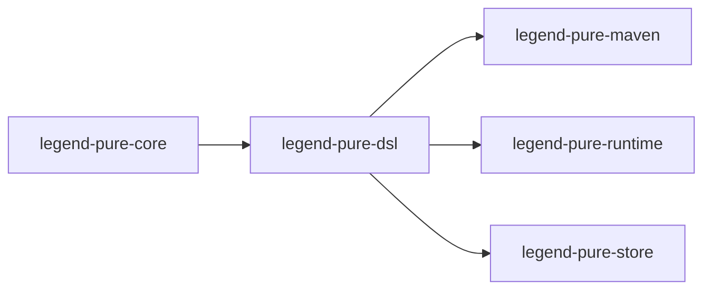
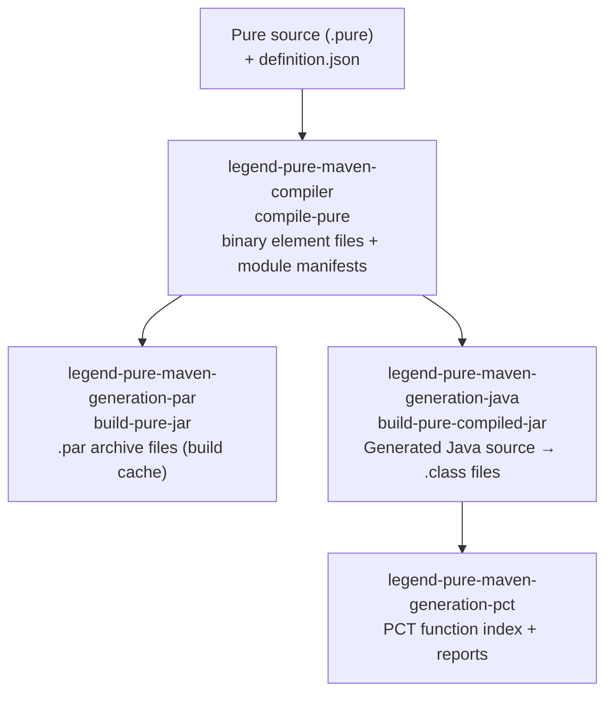

# Build & CI Guide

## 1. Full Maven Build Lifecycle

The build is driven by the root `pom.xml` at `legend-pure/pom.xml`. The module
reactor order is determined by the `<modules>` declaration and inter-module
dependencies:



### Custom Build Phases Summary

| Phase | Notable actions |
|-------|----------------|
| `initialize` | Register `target/generated-sources/` and `target/generated-test-sources/` as source roots (build-helper-maven-plugin) |
| `generate-sources` | ANTLR4 parser generation; M3 CoreInstance Java generation (`generate-m3-core-instances`); `JavaModelFactoryGenerator` for compiled runtime |
| `compile` | Standard Java compile; `compile-pure` plugin compiles Pure source to binary elements |
| `process-classes` | Second `maven-compiler-plugin` execution to compile generated sources that depended on the first compile pass |
| `process-test-classes` | PCT report generation for interpreted runtime (`exec-maven-plugin`) |
| `test-compile` | `dependency:analyze-only` validates declared vs used dependencies |
| `test` | `maven-surefire-plugin` runs JUnit 4 tests; JaCoCo collects coverage data |
| `verify` | `maven-checkstyle-plugin` checks style; JaCoCo generates HTML/XML coverage reports |
| `install` | Artifacts installed to local `~/.m2/repository` |

---

## 2. Custom Maven Plugins Deep-Dive

For the full reference — goals, configuration parameters, typical POM snippets, and
the rationale for each plugin — see the
[Maven Plugins Reference](../reference/maven-plugins-reference.md).

### How the Plugins Chain Together



### Classloader Isolation

Each Mojo constructs a `URLClassLoader` from the resolved compile-scope (or test-scope)
Maven dependencies and sets it as the thread context classloader before delegating.
This ensures the plugin sees the same classpath as the module being built, not the
Maven plugin classloader.

---

## 3. Dependency Analysis

The `maven-dependency-plugin` runs at `test-compile` with `failOnWarning=true`
and `ignoreNonCompile=true`. This means the build **fails** if:

- A compile-scope dependency is declared in `pom.xml` but not actually imported in
  any source file in that module.
- A compile-scope class is used in source but the dependency is not declared (even
  if it arrives transitively).

To debug dependency warnings:

```bash
mvn dependency:analyze -pl <module-path>
```

To see the full dependency tree:

```bash
mvn dependency:tree -pl <module-path>
```

To check for version conflicts:

```bash
mvn dependency:tree -Dverbose -pl <module-path> | grep "omitted for conflict"
```

---

## 4. Code Coverage (JaCoCo)

JaCoCo is configured in the root POM with two executions:

| Execution | Phase | Goal |
|-----------|-------|------|
| `pre-unit-test` | `test` (prepare-agent) | Instruments bytecode at test start |
| `post-unit-test` | `test` (report) | Generates HTML/XML report in `target/site/jacoco/` |

### Excluded from Coverage

The following generated-code paths are excluded:

- `org/finos/legend/pure/m4/serialization/grammar/**/*` — ANTLR4 generated parsers
- `org/finos/legend/pure/m3/serialization/grammar/**/*`
- `org/finos/legend/pure/m3/coreinstance/**/*` — Generated CoreInstance accessors
- `org/finos/legend/pure/m2/dsl/*/serialization/grammar/**/*` — DSL ANTLR4 parsers
- `org/finos/legend/pure/m2/relational/serialization/grammar/**/*`
- `org/finos/legend/pure/generated/**/*` — All generated Java from Pure

### Viewing Coverage Reports

After `mvn test`:

```bash
open legend-pure-core/legend-pure-m3-core/target/site/jacoco/index.html
```

---

## 5. GitHub Actions CI Pipeline

The pipeline is defined in [`.github/workflows/build.yml`](../../.github/workflows/build.yml).

### Trigger

Runs on every `push` and `pull_request` event.
Release commits (messages containing `[maven-release-plugin]`) are skipped.

### Environment

- **Runner:** `ubuntu-latest`
- **JDK:** Temurin 17
- **Maven cache:** `~/.m2/repository` keyed on `hashFiles('**/pom.xml')`

### Steps

| Step | Command |
|------|---------|
| Checkout | `actions/checkout@v4` |
| Cache Maven deps | `actions/cache@v4` |
| Setup JDK 17 | `actions/setup-java@v4` |
| Configure Git | Sets committer identity for release plugin |
| Pre-fetch deps | `mvn de.qaware.maven:go-offline-maven-plugin:resolve-dependencies` |
| Build + Test (non-master) | `mvn -B -e install -DforkCount=3 -DreuseForks=true ...` |
| Build + Test + Sonar (master only) | `mvn -B -e install -Psonar ...` |
| Upload test results | Uploads `surefire-reports-aggregate/*.xml` as artifact |
| Upload CI event | Uploads `github.event_path` for `test-result.yml` |

### Surefire Report Aggregation

All modules are configured with:

```text
-Dsurefire.reports.directory=${GITHUB_WORKSPACE}/surefire-reports-aggregate
```

This aggregates every module's test XML into a single directory, which is then
uploaded as a build artifact for the `test-result.yml` workflow to process.

### Release Process

Releases are managed via `maven-release-plugin` and are triggered by the
[`release.yml`](../../.github/workflows/release.yml) workflow. Do not trigger
releases manually unless you are the designated release engineer.

---

## 6. SonarCloud Integration

- **Project key:** `legend-pure`
- **Organization:** `finos`
- **Dashboard:** <https://sonarcloud.io/dashboard?id=legend-pure>
- Quality gate badges are displayed in the root `README.md`.
- The `-Psonar` profile is **only activated on `master` branch CI runs**; it is
  never needed locally.

---

*Back: [Getting Started Guide](getting-started.md) · Next: [Coding Standards](../standards/coding-standards.md)*
