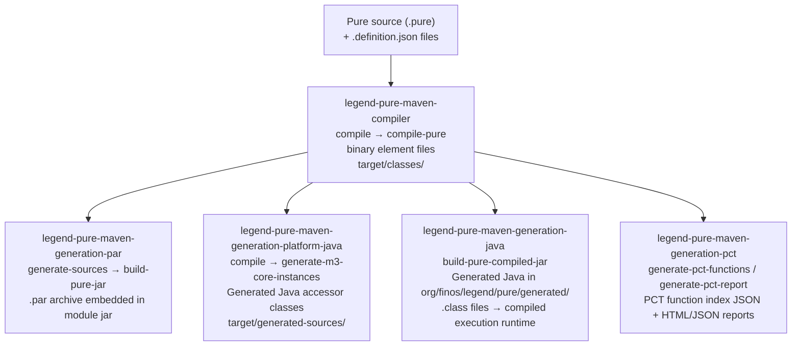

# Maven Plugins Reference

Legend Pure ships five Maven plugins (all under `groupId org.finos.legend.pure`)
that drive the Pure-specific parts of the build lifecycle.  Standard Maven
tooling (`maven-compiler-plugin`, ANTLR4 plugin, etc.) handles everything else;
the plugins described here handle the parts that no off-the-shelf tool can do.

---

## Why custom plugins are needed

Pure source (`.pure` files) is not Java.  Before any Java code can reference the
types and functions defined in Pure, several ahead-of-time steps must occur:

1. **Parse & compile** — Pure source must be type-checked and linked against its
   dependency graph.
2. **Binary serialisation** — The compiled element graph must be serialised to a
   portable binary format that can be loaded at runtime without re-parsing.
3. **Java accessor generation** — For every Pure class that Java code wants to
   interact with, a strongly-typed Java accessor class (`CoreInstance` subtype)
   must be generated so the rest of the codebase stays type-safe.
4. **Compiled-mode jar generation** — The interpreted runtime stores the Pure
   graph in memory at startup; the *compiled* runtime pre-generates Java bytecode
   from Pure functions so they run at full JVM speed.  That Java code must be
   generated and compiled as part of the build.
5. **Platform Compatibility Test (PCT) artefacts** — The PCT framework needs a
   static index of all Pure functions and the results of running the PCT test
   suite; both are generated by the build.

Each of the five plugins below owns exactly one of these responsibilities.

---

## Plugin overview

| Artifact | Goal(s) | Default phase | Role |
|---|---|---|---|
| `legend-pure-maven-compiler` | `compile-pure` | `compile` | Compile Pure source to binary element files |
| `legend-pure-maven-generation-par` | `build-pure-jar` | *(bound explicitly)* | Package compiled elements into a `.par` archive |
| `legend-pure-maven-generation-java` | `build-pure-compiled-jar` | *(bound explicitly)* | Generate and compile Java from Pure for the compiled runtime |
| `legend-pure-maven-generation-platform-java` | `generate-m3-core-instances` | `compile` | Generate Java `CoreInstance` accessor classes from Pure source |
| `legend-pure-maven-generation-pct` | `generate-pct-functions`, `generate-pct-report` | *(bound explicitly)* | Generate PCT function index and HTML/JSON compatibility reports |

A shared helper module (`legend-pure-maven-shared`) provides common utilities for
dependency resolution and classpath construction.  It is not itself a plugin.

---

## 1. `legend-pure-maven-compiler` — `compile-pure`

### What it does

Loads all Pure source files (`.pure`) and repository definition files
(`.definition.json`) found on the build classpath, compiles them with the full
M3 type-checker, and writes the resulting binary element files to the module's
output directory.  The output is the same as what the runtime loads at startup —
the plugin simply performs that work once at build time rather than repeatedly at
runtime.

### Why it is needed

Without ahead-of-time compilation, every application start would require
re-parsing and re-type-checking the entire Pure source tree (potentially thousands
of `.pure` files).  Pre-compiling to binary elements reduces startup time from
many seconds to milliseconds.

### Configuration parameters

| Parameter | Type | Default | Description |
|---|---|---|---|
| `outputDirectory` | `File` | `${project.build.outputDirectory}` (or test-output in test phase) | Where binary element files are written |
| `repositories` | `Set<String>` | *(auto-detected from `.definition.json` files)* | Explicit set of repository names to compile |
| `excludedRepositories` | `Set<String>` | *(none)* | Repository names to skip |
| `compileIndividually` | `Boolean` | `true` when repos are auto-detected, `false` when explicit | If `true`, repos are compiled one at a time in topological order |
| `dependencyScope` | `String` | `compile` (or `test` in test phase) | Maven dependency scope for classpath construction |

### Minimal usage

Declared in the root `pluginManagement` with a default bound execution; most
modules need only include the plugin with no extra configuration:

```xml
<plugin>
    <groupId>org.finos.legend.pure</groupId>
    <artifactId>legend-pure-maven-compiler</artifactId>
</plugin>
```

### Explicit repository selection

```xml
<plugin>
    <groupId>org.finos.legend.pure</groupId>
    <artifactId>legend-pure-maven-compiler</artifactId>
    <executions>
        <execution>
            <goals>
                <goal>compile-pure</goal>
            </goals>
            <configuration>
                <!-- Only compile these two repositories in this module -->
                <repositories>
                    <repository>platform_dsl_mapping</repository>
                    <repository>platform_dsl_store</repository>
                </repositories>
            </configuration>
        </execution>
    </executions>
</plugin>
```

---

## 2. `legend-pure-maven-generation-par` — `build-pure-jar`

### What it does

Takes Pure source files (`.pure`) and their repository definitions and packages
them into a **PAR archive** (a `.par` file bundled inside the module's jar).  The
PAR format is the on-disk serialisation of a compiled Pure repository; it can be
distributed as a Maven artifact and loaded by downstream modules without those
modules having to redistribute the `.pure` source.

### Why it is needed

Pure modules are distributed as jars, not as source.  Downstream consumers depend
on a module's PAR to bootstrap their own Pure runtime.  Without the PAR, a module
would need to ship and re-compile its entire Pure source tree transitively.

### Configuration parameters

| Parameter | Type | Default | Description |
|---|---|---|---|
| `sourceDirectory` | `File` | *(none — uses classpath scanning)* | Root directory of `.pure` source files |
| `purePlatformVersion` | `String` | *(none)* | Version string embedded in the PAR manifest |
| `modelVersion` | `String` | *(none)* | Optional model version string |
| `repositories` | `Set<String>` | *(auto-detected)* | Repository names to include |
| `excludedRepositories` | `Set<String>` | *(none)* | Repository names to skip |
| `extraRepositories` | `Set<String>` | *(none)* | Additional repository definition file paths to register |
| `outputDirectory` | `File` | `${project.build.outputDirectory}` | Where the PAR file is written |
| `dependencyScope` | `String` | `compile` (or `test` in test phase) | Maven dependency scope for classpath construction |

### Typical usage

```xml
<plugin>
    <groupId>org.finos.legend.pure</groupId>
    <artifactId>legend-pure-maven-generation-par</artifactId>
    <configuration>
        <sourceDirectory>${project.basedir}/src/main/resources</sourceDirectory>
        <purePlatformVersion>${project.version}</purePlatformVersion>
        <extraRepositories>
            <extraRepository>
                ${project.basedir}/src/main/resources/platform_dsl_mapping.definition.json
            </extraRepository>
        </extraRepositories>
    </configuration>
    <executions>
        <execution>
            <phase>generate-sources</phase>
            <goals>
                <goal>build-pure-jar</goal>
            </goals>
        </execution>
    </executions>
</plugin>
```

---

## 3. `legend-pure-maven-generation-java` — `build-pure-compiled-jar`

### What it does

Loads the compiled Pure graph (via the PAR files on the classpath), runs the Java
code generator across the selected repositories, and writes generated `.java`
source files (and optionally pre-compiles them to `.class` files) into the
module's output directory.  The generated code powers the **compiled execution
mode**: instead of interpreting Pure functions at runtime, the JVM executes native
Java methods.

### Why it is needed

The interpreted runtime is flexible but slower — it walks the Pure model graph to
execute every function call.  The compiled runtime is orders of magnitude faster
for production workloads, but requires ahead-of-time code generation.  This plugin
is the bridge that converts the Pure graph into real Java bytecode.

### Configuration parameters

| Parameter | Type | Default | Description |
|---|---|---|---|
| `repositories` | `Set<String>` | *(all)* | Repository names to generate Java for |
| `excludedRepositories` | `Set<String>` | *(none)* | Repository names to skip |
| `extraRepositories` | `Set<String>` | *(none)* | Additional repositories to include |
| `generationType` | `JavaCodeGeneration.GenerationType` | `monolithic` | Code generation strategy (`monolithic` = single-pass) |
| `skip` | `boolean` | `false` | Skip the goal entirely |
| `addExternalAPI` | `boolean` | `false` | Generate a public external API package |
| `externalAPIPackage` | `String` | `org.finos.legend.pure.generated` | Package name for external API classes |
| `generateMetadata` | `boolean` | `true` | Include metadata classes in generated output |
| `useSingleDir` | `boolean` | `false` | Write all generated files to a single flat directory |
| `generateSources` | `boolean` | `false` | Retain generated `.java` source files (useful for debugging) |
| `preventJavaCompilation` | `boolean` | `false` | Generate sources but skip the Java compilation step |
| `generatePureTests` | `boolean` | `true` | Generate Java test harness stubs for Pure unit tests |

### Typical usage

```xml
<plugin>
    <groupId>org.finos.legend.pure</groupId>
    <artifactId>legend-pure-maven-generation-java</artifactId>
    <executions>
        <execution>
            <goals>
                <goal>build-pure-compiled-jar</goal>
            </goals>
            <configuration>
                <repositories>
                    <repository>platform</repository>
                    <repository>platform_dsl_mapping</repository>
                </repositories>
                <!-- Retain .java files so you can read/debug the generated code -->
                <generateSources>true</generateSources>
            </configuration>
        </execution>
    </executions>
</plugin>
```

---

## 4. `legend-pure-maven-generation-platform-java` — `generate-m3-core-instances`

### What it does

Reads selected Pure source files (identified by name) and generates strongly-typed
Java **`CoreInstance` accessor classes** for every Pure class found in those files.
These accessor classes expose the fields and associations of Pure classes as
type-safe Java getters and setters, allowing the rest of the codebase to interact
with Pure model objects without raw `CoreInstance` manipulation.

The generated sources are automatically added as a compile source root so that
`maven-compiler-plugin` picks them up in the same build.

### Why it is needed

The M3 metamodel, the DSL metaclasses, and every extension class defined in Pure
all need Java-accessible wrappers.  Writing these by hand would be prohibitively
tedious and fragile.  This plugin generates them deterministically from the Pure
source of record, and the result is recompiled whenever the Pure source changes.

### Configuration parameters

| Parameter | Type | Default | Description |
|---|---|---|---|
| `factoryNamePrefix` | `String` | *(required)* | Prefix for generated factory class names (e.g. `Mapping` → `MappingCoreInstanceFactory`) |
| `fileNameSet` | `Set<String>` | *(required)* | Classpath-relative paths of the `.pure` files to process |
| `fileNameStartsWith` | `String` | *(none)* | Alternative to `fileNameSet`: generate for all `.pure` files whose classpath path starts with this prefix |
| `outputDir` | `File` | `target/generated-sources` (or `target/generated-test-sources` in test phase) | Where generated Java files are written |
| `addOutputDirectoryAsSource` | `boolean` | `true` | Register the output directory as a Maven compile source root |
| `dependencyScope` | `String` | `compile` | Maven dependency scope for classpath construction |
| `skip` | `boolean` | `false` | Skip the goal entirely |

### Typical usage

```xml
<plugin>
    <groupId>org.finos.legend.pure</groupId>
    <artifactId>legend-pure-maven-generation-platform-java</artifactId>
    <executions>
        <execution>
            <goals>
                <goal>generate-m3-core-instances</goal>
            </goals>
            <configuration>
                <factoryNamePrefix>Mapping</factoryNamePrefix>
                <fileNameSet>
                    <fileName>/platform_dsl_mapping/grammar/mapping.pure</fileName>
                </fileNameSet>
            </configuration>
        </execution>
    </executions>
</plugin>
```

---

## 5. `legend-pure-maven-generation-pct` — `generate-pct-functions` / `generate-pct-report`

### What it does

The **Platform Compatibility Test (PCT)** framework tracks which Pure functions
are supported by each execution backend (interpreted, compiled, relational, etc.).
This plugin provides two goals:

- **`generate-pct-functions`** — Calls a *scope provider method* that enumerates
  the full set of PCT-enabled Pure functions and writes a static function index
  (JSON) to a target directory.  The PCT test runner consults this index to know
  which functions to exercise.

- **`generate-pct-report`** — Runs a set of PCT test suite classes and produces an
  HTML/JSON report summarising which functions pass, which fail, and which are
  excluded per backend.  Supports both `Compiled` and `Interpreted` execution
  modes.

### Why it is needed

Without a static function index there is no machine-readable record of the Pure
standard library surface that backends are expected to support.  Without the
compatibility report, regressions in backend support go undetected until a user
hits them.  Both artefacts are generated during the build so they stay in sync
with the code automatically.

### Configuration parameters — `generate-pct-functions`

| Parameter | Type | Default | Description |
|---|---|---|---|
| `scopeProviderMethod` | `String` | *(required)* | Fully-qualified static method reference that returns the PCT function scope |
| `targetDir` | `String` | *(required)* | Directory where the generated function index is written |

### Configuration parameters — `generate-pct-report`

| Parameter | Type | Default | Description |
|---|---|---|---|
| `mode` | `Mode` | *(required)* | `Compiled` or `Interpreted` — which execution backend to exercise |
| `PCTTestSuites` | `Set<String>` | *(required)* | Fully-qualified class names of the PCT test suite classes to run |
| `targetDir` | `String` | *(required)* | Directory where the report files are written |

### Typical usage

```xml
<!-- Step 1: generate the PCT function index -->
<plugin>
    <groupId>org.finos.legend.pure</groupId>
    <artifactId>legend-pure-maven-generation-pct</artifactId>
    <executions>
        <execution>
            <id>generate-pct-functions</id>
            <goals>
                <goal>generate-pct-functions</goal>
            </goals>
            <configuration>
                <scopeProviderMethod>
                    org.finos.legend.pure.m3.pct.functions.Scope::getScope
                </scopeProviderMethod>
                <targetDir>${project.build.outputDirectory}/pct-functions</targetDir>
            </configuration>
        </execution>
    </executions>
</plugin>

<!-- Step 2: generate the PCT compatibility report (compiled mode) -->
<plugin>
    <groupId>org.finos.legend.pure</groupId>
    <artifactId>legend-pure-maven-generation-pct</artifactId>
    <executions>
        <execution>
            <id>generate-pct-report</id>
            <goals>
                <goal>generate-pct-report</goal>
            </goals>
            <configuration>
                <mode>Compiled</mode>
                <targetDir>${project.build.directory}/pct-report</targetDir>
                <PCTTestSuites>
                    <PCTTestSuite>
                        org.finos.legend.pure.runtime.java.compiled.pct.Test_COMPILED_StandardFunctions
                    </PCTTestSuite>
                </PCTTestSuites>
            </configuration>
        </execution>
    </executions>
</plugin>
```

---

## 6. `legend-pure-maven-shared` (utility module — not a plugin)

`legend-pure-maven-shared` is a plain `jar` dependency used internally by the
four other plugins.  It provides two shared utilities:

- **`ProjectDependencyResolution`** — Resolves the Maven project's transitive
  dependencies (compile or test scope) into a `URL[]` array used to construct a
  `URLClassLoader`.  Every plugin uses this to ensure it sees the same classpath
  as the module being built, not the Maven plugin classloader.

- **`DependencyResolutionScope`** — An enum (`compile`, `test`) with helper logic
  to auto-detect the correct scope based on the current lifecycle phase (e.g.
  automatically uses test scope when the current phase is `test-compile` or
  `test`).

---

## How the plugins chain together



### Classpath isolation pattern

Every Mojo constructs a `URLClassLoader` from the resolved Maven project
dependencies and sets it as the thread context classloader before delegating to
the underlying generator.  This is necessary because generators use `ServiceLoader`
and reflection to discover Pure extension classes, which live in the *module's*
classpath, not in the Maven plugin's classloader.

---

## Adding a new Pure module — plugin checklist

When creating a new module that contains `.pure` source files, decide which of the
following plugins you need:

| Plugin | Include when… |
|---|---|
| `legend-pure-maven-compiler` | Always — every module with `.pure` source needs compilation. Usually inherited automatically from root `pluginManagement`. |
| `legend-pure-maven-generation-par` | The module's compiled Pure must be distributed to downstream consumers (i.e. the module is a library). |
| `legend-pure-maven-generation-platform-java` | Java code in this module (or downstream modules) needs type-safe access to Pure classes defined here. |
| `legend-pure-maven-generation-java` | The module participates in the compiled execution runtime. |
| `legend-pure-maven-generation-pct` | The module adds Pure functions that should be PCT-tested across backends. |

---

*See also:
[Build & CI Guide](../guides/build-and-ci.md) ·
[Module Reference](../architecture/modules.md) ·
[Compiler Pipeline](../architecture/compiler-pipeline.md)*

---

## Real-world usage patterns

For detailed examples of how these plugins are invoked across the legend-pure
and legend-engine codebases — including exec:java argument contracts, the
dominant legend-engine configuration, and PCT report mode usage — see
[Maven Plugins — Real-world Usage Patterns](maven-plugins-usage-patterns.md).
