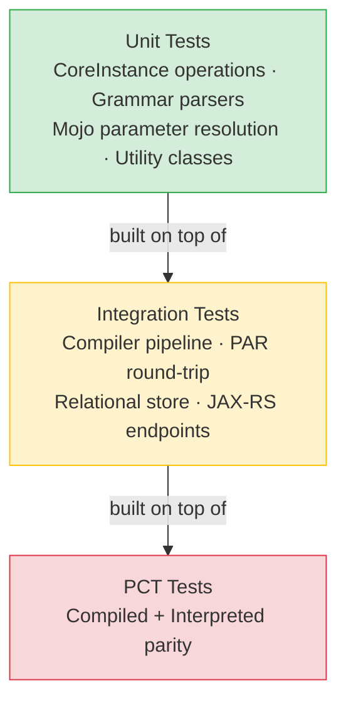

# Testing Strategy & Requirements

## 1. Testing Philosophy

Legend Pure follows a **pragmatic testing pyramid**: the vast majority of tests are
fast unit tests; integration tests exercise the compiler pipeline and runtime engines
end-to-end; there are no UI or system-level E2E tests (this is a library project).



---

## 2. Test Frameworks in Use

| Framework | Version | Purpose |
|-----------|---------|---------|
| **JUnit 4** | 4.13.1 | **Sole test framework.** `@Test`, `Assert.*`, `@Rule`, `@ClassRule`. JUnit 5 is not used and must not be introduced. |
| **Eclipse Collections TestUtils** | 10.2.0 | `Verify.*` assertions for Eclipse Collections types. |
| **Jersey Test Framework + Grizzly2** | 2.25.1 | Spin up an in-process JAX-RS server for REST-layer integration tests. |
| **JUnit 4 `TemporaryFolder` rule** | built-in | Create temporary directories and files in tests; auto-deleted after each test. |
| **Hand-written stubs (no Mockito)** | — | Project convention: construct real objects or simple hand-written stubs rather than introducing Mockito. |
| **H2 Database (embedded)** | 2.1.214 | In-memory JDBC for relational store integration tests. |
| **DuckDB (embedded)** | 1.0.0 | In-process analytical JDBC for TDS integration tests. |

> **No mocking framework.** This is a deliberate project decision. If you need to
> isolate a dependency, either use a real lightweight implementation or write a
> package-private stub class.

---

## 3. Test Class Conventions

### Naming

| Type | Naming pattern | Example |
|------|---------------|---------|
| Unit test | `Test<SubjectClass>` | `TestM3Compiler`, `TestPureCompilerMojo` |
| Integration test | `Test<SubjectClass>Integration` or `TestAbstractXxx` | `TestAbstractRelationalStore` |
| PCT test | `Test_<Mode>_<Suite>_PCT` | `Test_Interpreted_EssentialFunctions_PCT`, `Test_Compiled_GrammarFunctions_PCT` |

### File Location

Tests live in `src/test/java` of the module they test. Do not place tests for
module A in module B.

### Package

Test classes should be in the **same package** as the class under test (or a
sub-package if grouping is needed) to access package-private members.

### Test Data Setup

- Prefer `@Before` / `@After` over `@BeforeClass` / `@AfterClass` for test isolation.
- Use `TemporaryFolder` rule for any filesystem operations:

  ```java
  @Rule
  public TemporaryFolder tempFolder = new TemporaryFolder();
  ```

- For Pure compilation tests, construct a minimal `PureRuntime` with only the
  repositories needed for the test, rather than loading the full platform.

### Field Injection in Mojo Tests

Since Mojos use Maven dependency injection (not constructor injection), test classes
set Mojo fields via reflection:

```java
PureCompilerMojo mojo = new PureCompilerMojo();
Field outputDir = PureCompilerMojo.class.getDeclaredField("outputDirectory");
outputDir.setAccessible(true);
outputDir.set(mojo, tempFolder.newFolder("output"));
```

This is the established pattern; do not introduce `maven-plugin-testing-harness`
unless the team agrees.

---

## 4. How to Run Tests

### All Tests (Full Suite)

```bash
mvn test
```

### Single Module

```bash
mvn test -pl legend-pure-core/legend-pure-m3-core
```

### Single Test Class

```bash
mvn test -pl legend-pure-core/legend-pure-m3-core \
  -Dtest=TestM3Compiler -DfailIfNoTests=false
```

### Single Test Method

```bash
mvn test -pl legend-pure-core/legend-pure-m3-core \
  -Dtest="TestM3Compiler#testSimpleClass" -DfailIfNoTests=false
```

### Skip Tests

```bash
mvn install -DskipTests
```

### Run Tests in Parallel (as CI does)

```bash
mvn test -DforkCount=3 -DreuseForks=true
```

### Run PCT Tests Only

PCT tests follow the naming pattern `*_PCT.java`:

```bash
mvn test -Dtest="*_PCT" -DfailIfNoTests=false
```

---

## 5. Platform Compatibility Tests (PCT)

PCT is the **most important integration test category** in the project.

### Purpose

PCT guarantees that the **compiled engine** and the **interpreted engine** produce
identical results for every Pure function in the standard library. A PCT test failure
means one engine has a bug or an unimplemented feature.

### How PCT Works

1. Pure functions are annotated with `@PCT` in their Pure source.
2. `legend-pure-maven-generation-pct` generates a JSON index (`FUNCTIONS_<module>.json`)
   listing all PCT-annotated functions.
3. PCT test classes (in `legend-pure-runtime-java-engine-compiled` and
   `legend-pure-runtime-java-engine-interpreted`) read the index and execute each
   function against their respective runtime.
4. `exec-maven-plugin` generates a JSON report during `process-test-classes`.

### PCT Report Location

```text
legend-pure-runtime/legend-pure-runtime-java-engine-interpreted/
  target/classes/pct-reports/
legend-pure-runtime/legend-pure-runtime-java-engine-compiled/
  target/classes/pct-reports/
```

---

## 6. Code Coverage

### JaCoCo Configuration

JaCoCo is configured in the root POM (see [Build & CI Guide](../guides/build-and-ci.md#4-code-coverage-jacoco)).

### Coverage Thresholds

No hard numeric threshold is currently enforced in the build. The expectation is:

- **New code** should be covered by unit tests.
- The SonarCloud quality gate monitors coverage trends on the `master` branch.
- Aim for **≥ 80% line coverage** on hand-written classes in `legend-pure-m3-core`
  and `legend-pure-runtime-java-engine-*`.

> Generated code (ANTLR4 parsers, `CoreInstance` accessors, `generated/` packages)
> is excluded from JaCoCo measurement — do not write tests solely to cover
> machine-generated code.

### Viewing Coverage Locally

```bash
mvn test
# Open per-module report:
open legend-pure-core/legend-pure-m3-core/target/site/jacoco/index.html
```

---

## 7. CI/CD and Tests

See [Build & CI Guide](../guides/build-and-ci.md) for the full pipeline description.

Key test-related CI behaviours:

- **Parallel forks:** CI runs with `-DforkCount=3 -DreuseForks=true` to parallelize
  test execution across 3 JVM forks per module.
- **Surefire report aggregation:** All modules write their Surefire XML to
  `${GITHUB_WORKSPACE}/surefire-reports-aggregate/` for the `test-result.yml`
  workflow to process.
- **Test results artifact:** Uploaded as `test-results` artifact on every run
  (including failures), enabling post-run inspection.
- **No flaky test tolerance:** Intermittently failing tests must be fixed or
  annotated with `@Ignore` with a linked issue; they must not be left to flap.

---

## 8. Testing New Maven Plugins / Mojos

### Summary of the approach

1. Add `junit:junit:${junit.version}` with `<scope>test</scope>` to the plugin module.
2. Use reflection to set `@Parameter`-annotated Mojo fields.
3. Test **parameter resolution methods** (e.g. `resolveOutputDirectory()`) by calling
   them directly after field injection.
4. Test **`execute()`** by wiring all required fields and calling `mojo.execute()`
   directly — no `maven-plugin-testing-harness` needed.
5. Use `TemporaryFolder` for any filesystem assertions.

---

*Back: [Coding Standards](../standards/coding-standards.md) · Next: [Documentation Maintenance](../maintenance/maintenance.md)*
